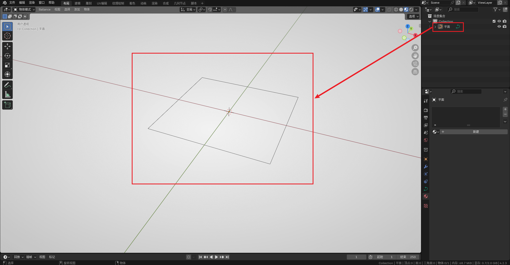
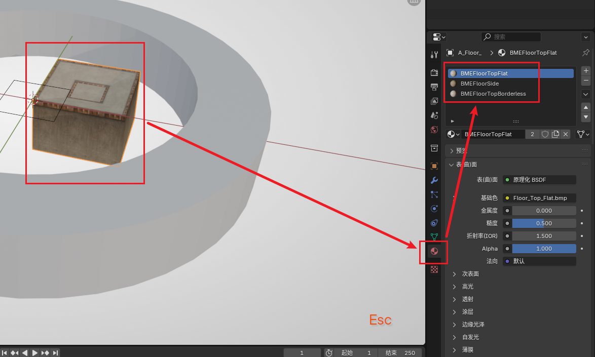
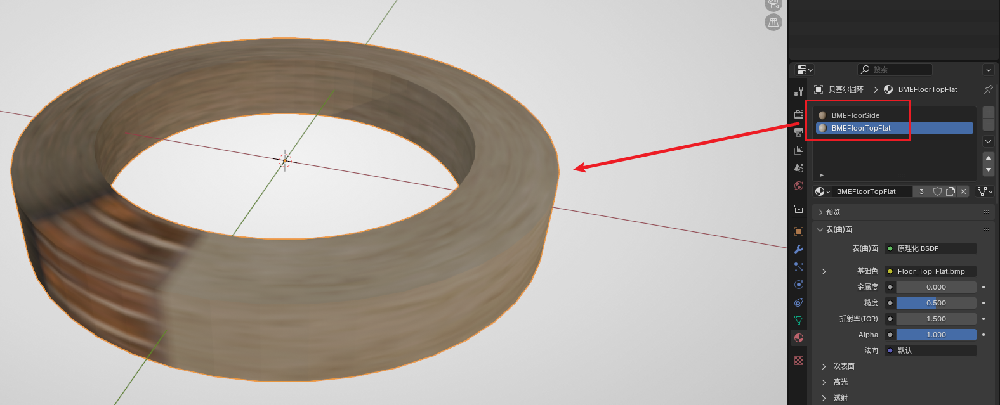
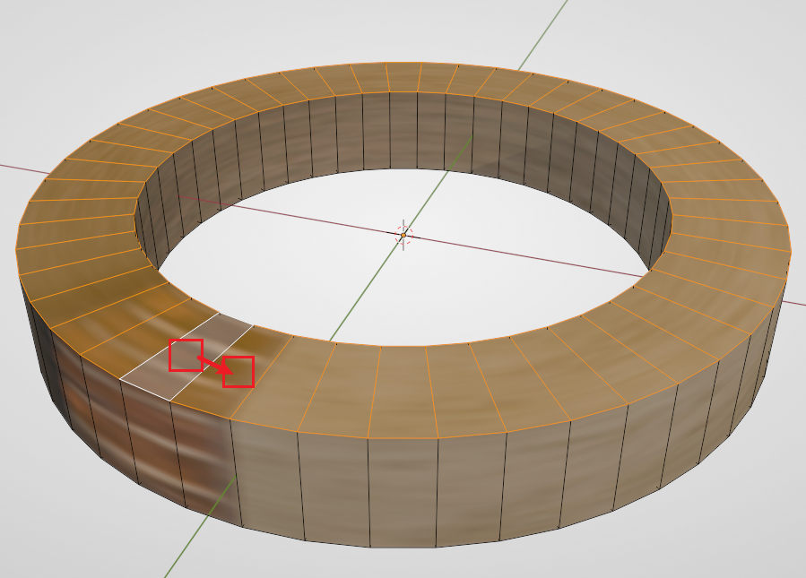
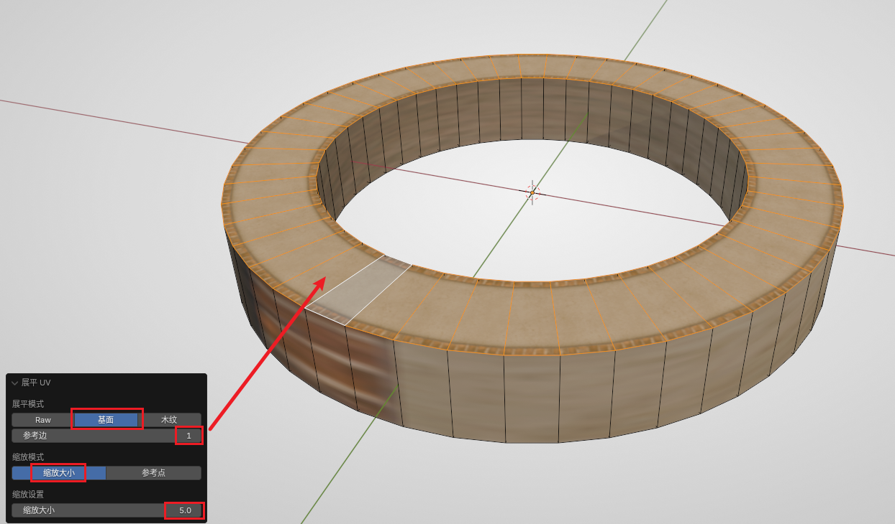
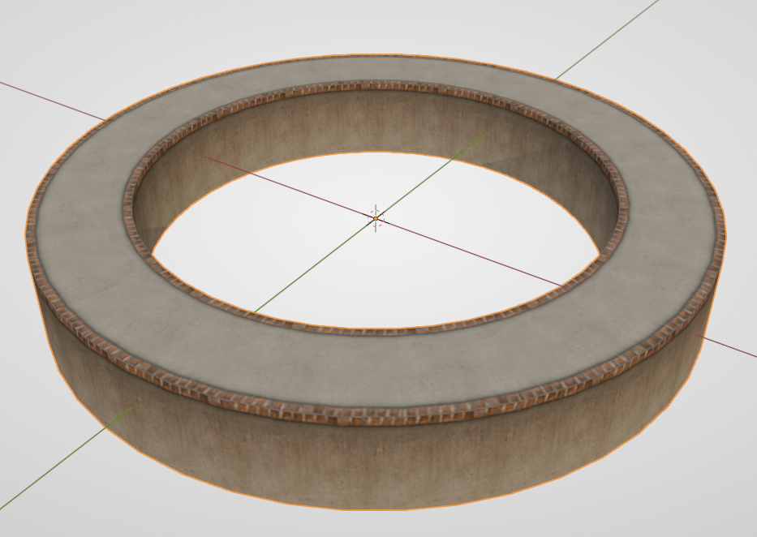

# 放样制作路面

建议新手先从[放样制作钢轨](./sampling-rail.md#放样)开始。本篇文章将不再讲述放样的细节，着重讲解基于曲线的路面如何制作。

## 准备截面

由于 BBP 没有提供路面的截面，我们需要自己构建。好在路面的曲线非常容易构建。

首先可以直接在 `添加 - 网格 - 平面` 创建一个平面，并在左下角的交互框中将平面的尺寸设置为 5，即 Ballance 标准路面的截面尺寸。

随后进入编辑模式，按 `3` 进入面选择模式，选中该平面，按 `X` 选择 **仅面**。该操作会将面删除但保留其边框。

最后退出编辑模式，右键将其转化为曲线即可。最终结果如下图所示：

## 绘制曲线以及放样

在 Blender 中创建任意曲线（本篇教程后续同样以贝塞尔圆环为例）。再次提醒：**切记曲线不可以使用缩放操作。**

放样的操作与钢轨放样一致，参见[放样制作钢轨](./sampling-rail.md#放样)。放样结束后，记得将路面转为网格，以便进行后续操作。

刚放样出来的路面大概率是 **一坨** ~~（字面意思）~~，此时我们可以先右键把放样结果设置为“平直着色”，后续操作中方便观察。

## 后续处理

“归组”与“翻面”操作可参考放样制作钢轨的[后续处理部分](./sampling-rail.md#后续处理)，归入路面组即可，这里不作赘述，仅讲解与钢轨不同的部分。

### 材质

路面的材质较为复杂，因为涉及到不同的面的材质。

首先我们从 BBP 中添加一个细边装饰平台（Ribbon Platform），因为它有我们制作 **平直路** 所需要的全部材质。如下图所示：

主要是 `BMEFloorTopFlat` 和 `BMEFloorSide`。创建完材质我们就可以将这个路面删除了。如果你的地图里已经有了这些材质，那么也可以不创建这个路面。

随后回到我们放样的路面上，新建两个材质槽，为这个路面添加上述两个材质。（如果上完材质发现面反了要记得翻转面哦）

然后进入编辑模式，利用 `Alt` 键可以环选，首先环选顶面。方法为：先单击选中一个面，然后按住 `Alt` 选择它旁边的一个面，即可环选。

选择所有顶面后，在材质面板选择 `BMEFloorTopFlat`，然后点击 **指定**，就可以将顶面材质施加给顶面。但目前的 UV 并不正确，我们需要借助 BBP 的 UV 工具展平 UV。保持顶面的选中状态，然后在 Ballance 菜单中选择 `Flatten UV`（展平 UV），随后观察左下角的对话框，我们需要选择 **路面专用的展平模式**（第二项），缩放模式选择 **按大小缩放**，缩放设置中的大小填写5。然后调整对话框中的 **参考边**（一般从0开始往上增加即可），直到你的路面顶面变得正常，如下图所示：

同理，利用环选和展平 UV 可以将路面侧面的材质指定为：`BMEFloorSide`。操作与顶面大致相同，这里就不过多赘述。最终的成品如下图所示：

### 删面与补面

由于路面底面在 Ballance 原版游戏中是不可见的，所以我们可以将其删除以减小模型所占储存空间。同样借助环选功能选择底面，然后按 `X` 选择“面”即可。

如果你的路面不是自闭合的，应该可以很明显看到路段两头是空的，非常不美观。解决方法也很简单，选中端面的四个顶点，按 `F` 创建面。然后为其指定 `BMEFloorSide` 材质，再展平 UV 即可。

### 设置平滑着色

全部处理结束后，可以将物体设置为 **自动平滑着色**，角度可以视情况自由选择，一般的标准是：路面表面和侧面不会糊成一坨，并且侧面看不出显著的折线。
