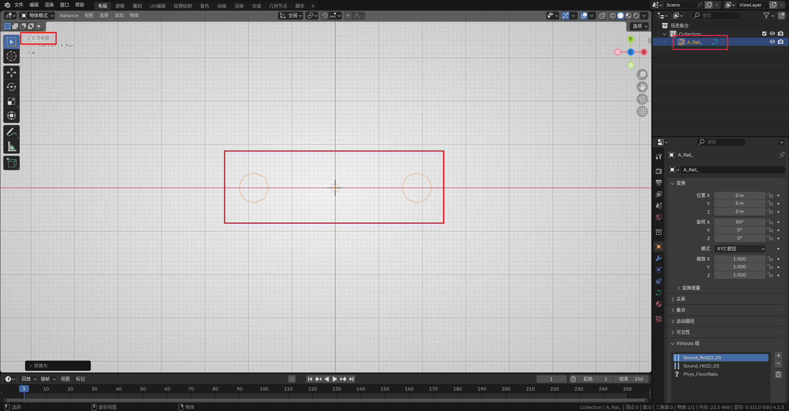
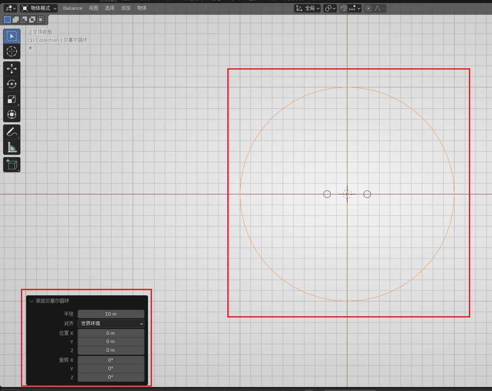
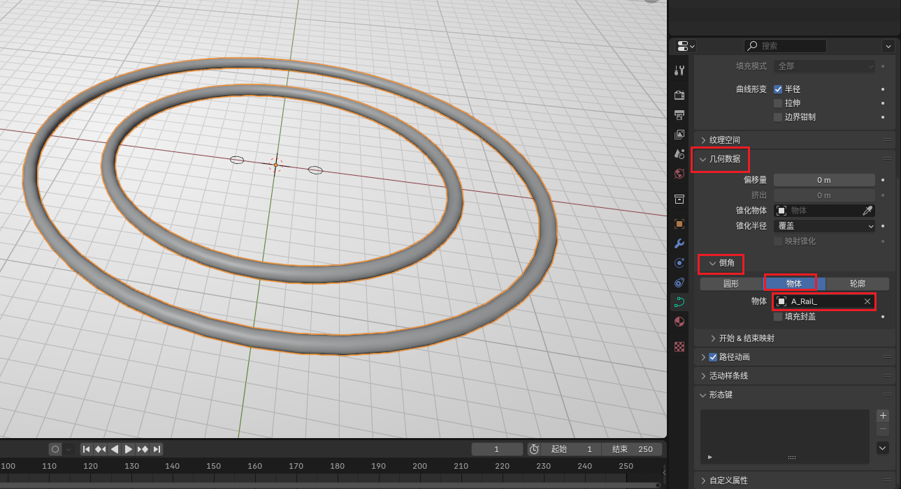
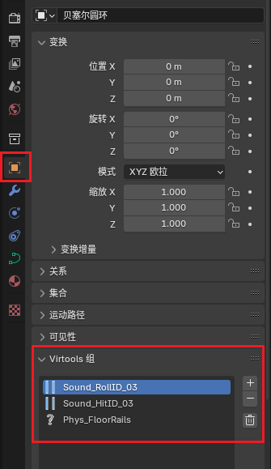
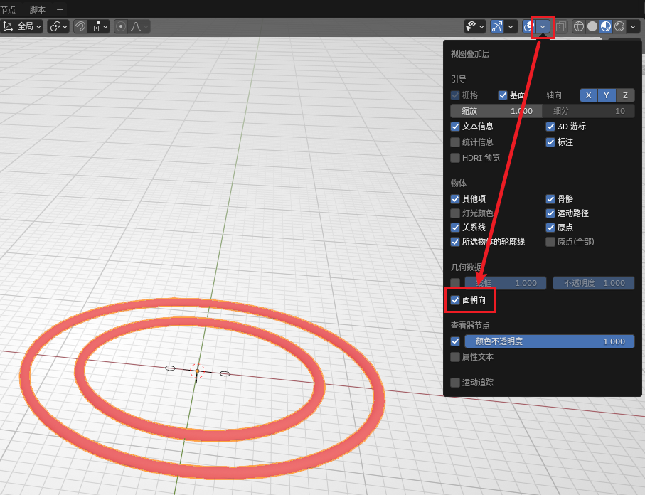

# 放样制作钢轨

原版游戏13关最后一小节有非常复杂的螺旋轨道，可以达到类似过山车的效果，本章内容将演示如何制作花式钢轨。

## 准备截面

截面可使用 BBP 提供的钢轨截面。这里我们用双轨举例。

首先可以直接在 `添加 - Rails - Rail Section` 创建一个钢轨截面，它的形状应该是两个正八边形。在生成时也可以在左下方的交互窗口内选择单轨。此时的截面不可以直接用于放样，我们需要做两步预处理：

- 由于默认朝向为 Y 轴方向，这里需要将其绕 X 轴旋转 `90°`，使其完全处于 XY 平面上，然后按 `Ctrl + A` 选择应用旋转。
- 右键将其转换为曲线。

!!! note
    钢轨截面也可根据[钢轨参数](../mapping/rail-parameter.md)手动创建。

如果在“顶视图”下观察可以看到两个正八边形的曲线即为成功。

## 绘制任意曲线

在 Blender 中创建任意曲线。新手建议创建圆环（设置较大半径）尝试，熟练后可以创建贝塞尔曲线。本教程以最简单的圆环举例。

**切记曲线不可以使用缩放操作。**

## 放样

在创建的曲线的面板中（不是截面）找到几何数据，将其中的倒角选择为“物体”，并将物体设置为刚刚的截面，即可看到生成的环形轨道。

如果你的曲线有角度较大的拐弯，制作的弧形轨道棱角分明时，可以在 `数据 - 形状 - 预览分辨率 U` 处可以设置每两个点之间的分段数。提高此处的数值可以创建更多分段，使最终的轨道看起来更平滑。但要注意过多的分段可能会造成游戏卡顿或物理 bug，在保证视觉效果的前提下尽量使用更少的分段。

放样结束后，还需要右键该曲线，将其转化为网格。转化为网格后，钢轨的截面就可以安全地删除了（也可以保留以备下一次放样）。

转为网格后，曲线就不能再编辑了，在转网格前务必将曲线参数调整正确。

## 后续处理

### 归组

该放样方法制作的轨道是没有组信息的，直接导入游戏会不可碰撞。需要手动归组至如下图的三个组：

### 翻面

按下图打开“面朝向”显示：

如果观察到轨道的面是红色的，说明该面的朝内，在游戏内会导致视觉效果错误。此时我们进入编辑模式，选中所有红色的面，按下 `Alt + N`，然后选择翻转，观察到面变为蓝色即可。

### 补面

如果你的钢轨不是环形钢轨，并且钢轨两端是外露的（既没有塞在路面里，也没有连接其它钢轨等），那么尽量将断面补齐，否则游戏内看会看到空心的钢轨。

进入编辑模式，选中断面的8个顶点，按 F 即可创建面。默认情况下法线是正常处理的（即新加入的面不会影响原有法线信息）。若观察到断面不是“截断”的，而是类似于“圆头”的，那么选中钢轨，使用自动平滑着色，角度调整至 `50°` 即可。

### 材质

该放样方法制作的轨道也没有材质信息，但好在钢轨的材质信息非常容易添加，只需在材质面板处添加 `Rail` 材质即可。如果没有找到这个材质，可以先从素材库中拖一个护栏出来，护栏上会带有这个材质。加好材质后就可以删除不需要的护栏。

如果材质延展不正确，可以在 Ballance 菜单中选择`钢轨 UV`，使材质变为像游戏中一样的视觉效果。
