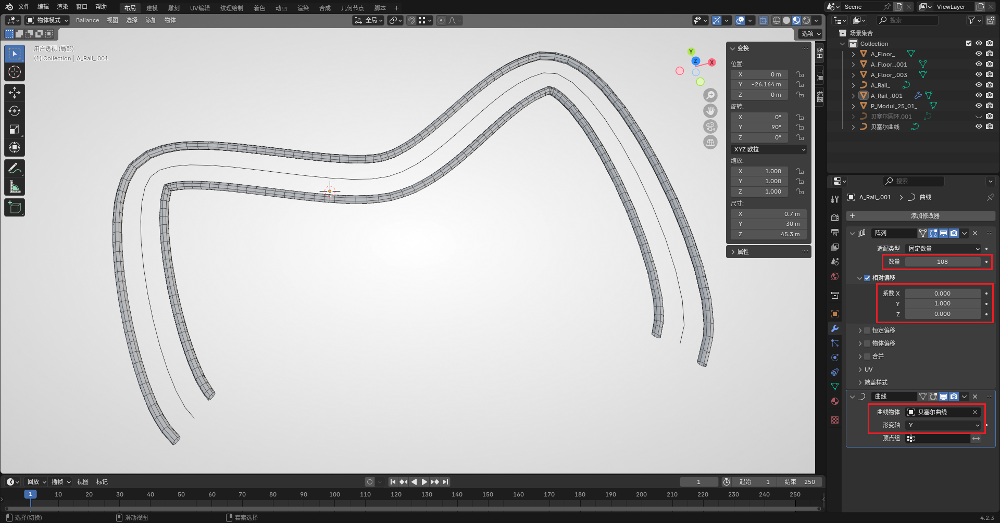

# Blender 放样方法

在 3ds MAX 中 **创建复杂的路面、轨道** 一般使用放样的方式。Blender 中也有相似的操作，主要有以下两种：

- 曲线放样
- 阵列修改器 + 曲线修改器

第一种方法与 max 中的放样操作更为相似，但有时也需视情况灵活使用两种方法。

## 曲线放样

参见：[放样制作钢轨](../advance/sampling-rail.md)、[放样制作路面](../advance/sampling-floor.md)

## 基于修改器

此方法需要一条较短的钢轨作为基础物体，可以直接使用插件添加一段钢轨（不是钢轨截面）。并创建一段曲线作为备用。

首先在钢轨的修改器面板，添加一个阵列修改器（`生成 - 阵列`）。其中的 **相对偏移** 处需要手动设置，设置方法为需要往哪个轴延伸，就将哪个轴填为 1（反方向则填 -1）。随后将 **数量** 改为一个较大的值。这些参数随后还可以动态调整更改，所以不必在意具体数值。

随后继续添加一个曲线修改器（`形变 - 曲线`）。将 **曲线物体** 设置为提前创建的曲线，将 **形变轴** 改为和刚刚相对偏移相同的轴（即刚刚填 1 或 -1 的轴）。此时应该就能看到物体阵列会沿曲线分布。

此时可以根据生成物体的效果进行进一步操作：

- 若分布的长度不够，可以增加阵列修改器的数量参数。
- 若棱角过于明显，可以按 `Tab` 编辑顶点将原钢轨缩短。
- 若满意最终效果，也可将所有修改器应用，将网格固定。（建议在做完相关设计后再应用，以防需要更改参数）

此方法构建的物体无需重新归组，但在曲线存在拐角较大处效果较差，建议用于构建拐弯相对平滑的物体。

