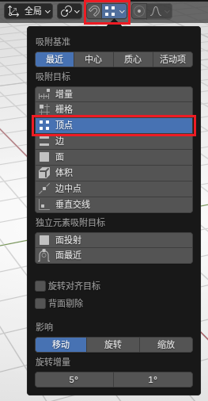
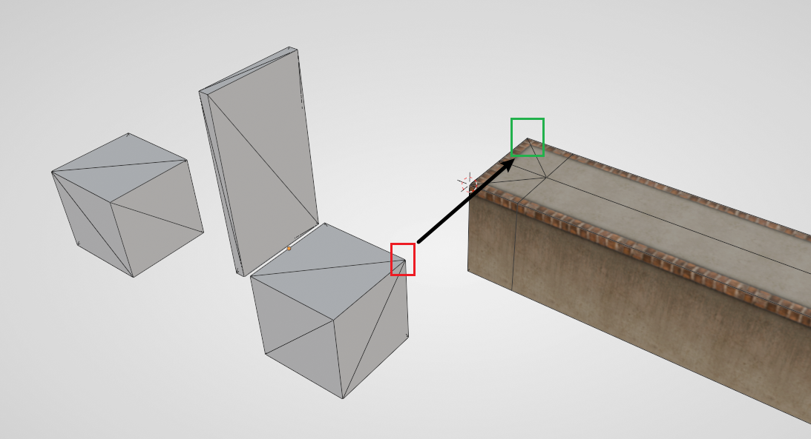
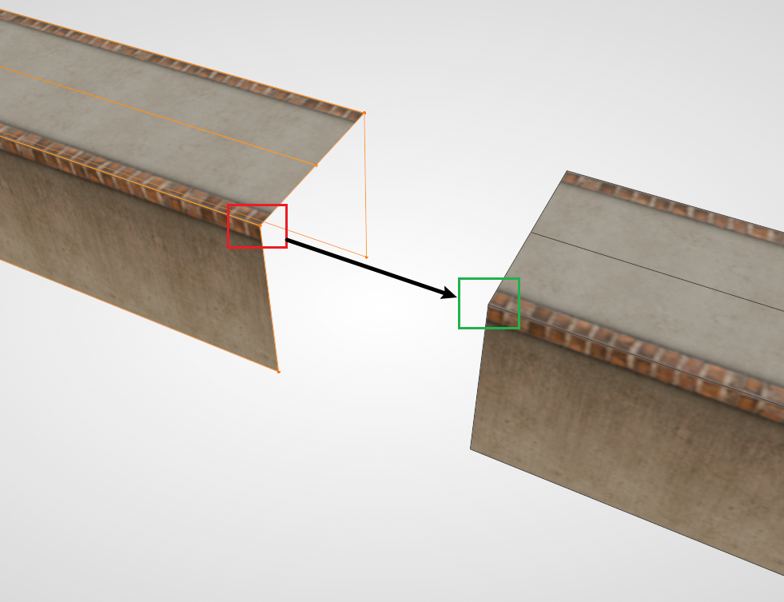

# 吸附功能详解

Blender 中自带有强大的吸附功能，该功能可用于对齐、贴附等操作。相当一部分情况下，吸附功能能够有效代替传统的物体对齐，并且效率更高，更直观易于使用。

## 全局启用

在3D视图的顶部找到吸附的选项，选择其中的 **顶点**，并选中按钮中的磁铁即可。选择顶点吸附是因为顶点吸附的精度最高，且在 Ballance 制图中最常用。特殊情况下也可选择“边”吸附。

留意到上图 **并没有** 选中磁铁，这是因为 Blender 有快捷键可以随时切换是否启用吸附功能，该快捷键默认为 `Shift + Tab`。建议需要的时候开启，否则在移动物体（特别是编辑模式下移动顶点时）很容易四处乱吸附。

## 更推荐的启用方式

在需要移动物体时，首先按下 `G`，然后按下 `B`，此时会进入 **锚点选取模式**。此模式时，物体不会移动，我们可以选择场景中任意一个顶点作为 **起始点**（包括要移动的物体本身的点）。

选取起始点后，物体会跟随鼠标移动，并且此时需要选择一个 **目标点** 作为终点。目标点同样可以是场景中任意一个顶点。

## 应用场景

### 对齐机关

部分机关的物体原点并不在机关的几何中心，且机关的占位模型本身并不对称，使用传统方法放置机关是较为麻烦的一件事，而使用顶点吸附能够以非常简单且直观地方式完成需求。

以推板为例，目标路面的末端和推板的辅助方块应当完全对应，所以可以直接使用顶点吸附一步到位。

### 路面补长

很多时候两头路面都做好时，中间可能会少一段，这时可以将其中一侧的路面直接利用顶点拉长以补齐。

拖动顶点保持材质正常的操作需要用到自动调整UV的功能。具体操作可以查看[梨栠式拖动创建](./liren-drag.md)。

