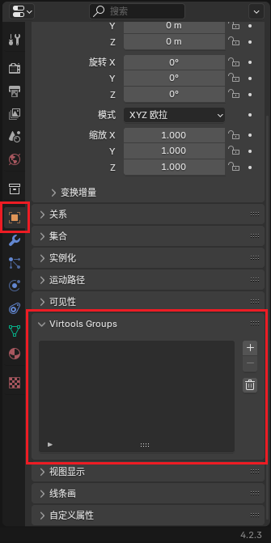

# 归组

归组是制作 Ballance 地图中除了建模以外的最重要的事情。通过归组，Ballance 得以了解哪些物体是路面，哪些物体是机关，哪些物体又是装饰，并为它们赋予各自不同的属性和行为。

有关归组的细节请查看 Ballance Wiki 的[归组页面](https://ballance.jxpxxzj.cn/wiki/%E5%BD%92%E7%BB%84)，本文仅讲解如何在 Blender 中操作组，以及相关的注意事项。在阅读本篇文章前请确保您已正确安装了 BallanceBlenderPlugin。

## 基本规则

首先简单介绍一下 Virtools 组的概念：

- 每一个组都有一个名称，例如 `Phys_Floors`，`Sector_01` 等。
- 每一个组包含一个3D物体列表，列表中的物体我们称为它被归入了这个组。
- 同一个3D物体可以归入多个组。
- 组之间不互相嵌套。

Ballance 通过一些固定的组的名称，来为组内的物体赋予不同的特性。例如路面组（Phys_Floors）中的物体会被物理化，使其具备碰撞箱；道具组中的物体会被替换为真正的机关道具等。

## 在 Blender 中归组

该功能由 BallanceBlenderPlugin 提供。在每个物体的物体属性面板内能够找到 `Virtools Groups` 菜单，可以添加所有 Ballance 支持的预定义的组，也可添加自定义名称的组。所有组信息会在导出时自动转化为 Virtools 组。

另外，由插件生成的物体、制图资产库中的物体，均已经归好组，除非特殊需求，一般无需做过多调整。
