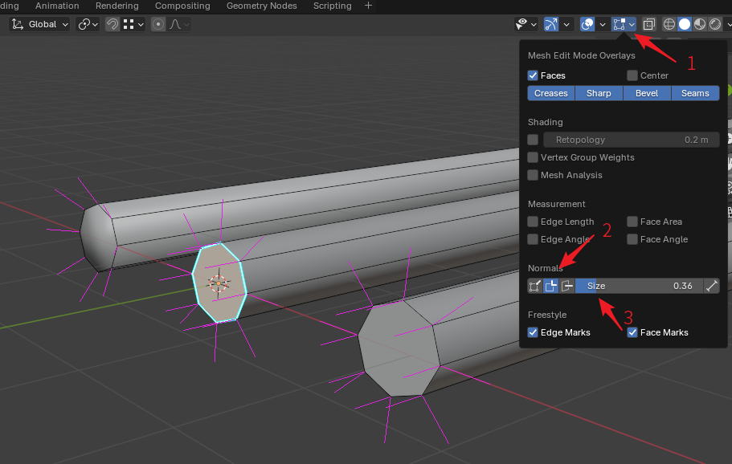
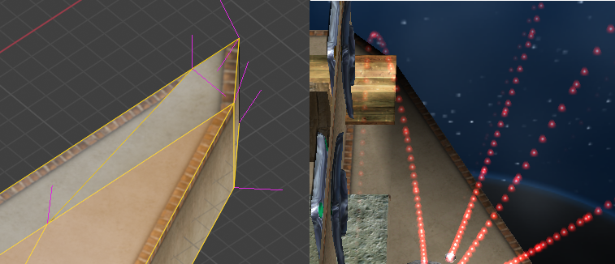
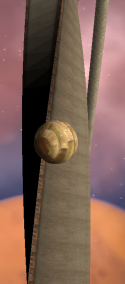

# 路面发黑

使用Blender创建Ballance地图时会偶尔发生进入游戏后的路面显示偏黑的情况。虽然这里说的是路面发黑，但不局限于路面，钢轨，木板，甚至是装饰在设置不合理的情况下也会发黑，这里的路面是一个泛指。

概括地来说，Ballance里路面发黑无外乎由两个原因导致：法线错误，或材质错误。或者更复杂一点，两者皆有。下面分别介绍这两种错误以及如何解决。

## 法线错误

### 钢轨接头

钢轨接头处的法线是新手最容易出错的地方，即最容易产生黑色斑点的地方，下图展示了如何打开法线显示和钢轨接头法线的常见错误。

为了显示法线，我们首先要进入编辑模式，然后打开右上角视图叠加层面板（箭头1），然后找到Normal栏，点击勾选第二个法线显示选项（箭头2），这将打开分立法线显示。然后在右侧调整法线显示长度，直到3D视图中粉红色法线的长度合适为止。

图中从左到右分别展示了：错误的钢轨接头法线，以及使用两种不同解决方案改出的正确钢轨接头法线。通常来说，我们希望钢轨平滑，因此很自然地会右键钢轨选择自动平滑，但这样操作会导致钢轨接头处的法线被平滑了，这不是我们想要的，为了将最左侧的错误转换到右侧的正确法线，一种解决方案是选择接头的边线，然后选择菜单`Edge - Makr Sharp`，将它们标记成锐边，这样钢轨的侧边和顶端的法线就会分离开，成为我们希望的样子。这就是中间的钢轨接头的样子。另一种方法是将钢轨截面单独选中，选择菜单`Face - Shade Flat`，单独将界面改为平直着色，也可以达成同样的效果。

最后还有另外一个简单粗暴的方案，就是物体模式下右键钢轨选择自动平滑着色，并将角度设置为50。但需要注意的是，设置完成后请转到修改器栏将自动平滑着色修改器应用，因为从Blender 4.1开始，平滑着色作为修改器而存在，然而BBP在保存物体的时候会忽略修改器，所以请务必在保存地图前应用所有修改器。

### 路面法线

下图展示了一张由于路面法线错乱导致路面发黑的问题。

左侧是这块路面在Blender中开启了法线显示后的截图，右侧则是这个路面在游戏中呈现的样子。显然可以注意到，路面拐角处的法线出现了错误，尤其是侧边的法线，指向了错误的方向。通过灵活使用锐边和平直平滑着色，可以修复这些法线错误，以让其在游戏内渲染正确。

### 无论如何都无法修复

通常来说，法线可以通过重新计算，或者平直平滑着色来进行修复，但是如果你遇到了无论怎么操作，法线就是不听使唤的情况（这种情况通常发生在编辑导入的，或者自动生成的物体的时候）。这多半是由于物体的自定义法线数据没有被删除导致的。解决方案是先选中所有面，然后点击菜单`Mesh - Normals - Reset Vectors`清除所有自定义法线数据，这样以来法线应该就会听从你的指示了。

## 材质错误

材质错误也是造成路面发黑的原因之一，许多早期地图就是因为材质设置错误，从而导致路面发黑，甚至被迫通过加灯泡的方法来解决路面过暗的问题。最常见的错误就是将路面顶部的贴图应用于路面侧边，从而显示发黑，如下图所示：

你会发现侧边材质无论在哪里显示都很正常，而顶面材质转到侧边时就会变得一片漆黑。这种错误实际上是由Ballance光照系统导致的，Ballance游戏中的主光源是一个带有倾斜角度的太阳光，因此被太阳光照射不到的一面就会完全是黑色，需要将材质中的Emissive选项设置成偏白色来弥补这种丑陋。这正是路面侧边材质所做的。如果直接将路面顶部这种没有白色Emissive弥补的材质直接应用于侧面，理所当然地会发黑。

解决方案有两种，一是打开官方的关卡，看看其他人在相似结构中设置的材质数值是多少，这是一个普适的解决方案。另一个解决方案则是利用BBP插件中内置的BMERevenge路面创建功能。BMERevenge路面创建功能为了能够创建高度大于5的路面，配置了两个特殊的材质：`BMELightingFloorTopBorder`和`BMELightingFloorTopBirderless`。如果你曾经在地图文件中插入了高度大于5的路面，这两个材质则会自动被生成。你可以直接利用这两个材质来进行创建，它们尽管看起来是路面顶部材质，但在侧边可以正常显示，不会发黑。

顺带一提，如果你仔细观察Level 2开头的倾斜木板，你会发现向左倾斜的和向右倾斜的木板的上表面的材质是不同的，两者有细微的差别，这正是对阳光的一种弥补，通过这种弥补，强行让它们在游戏里看起来没有差别。

