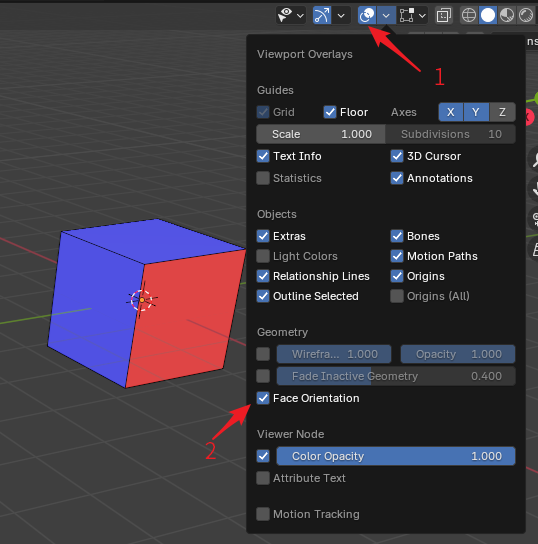

# 翻面

Ballance基于性能考量，会对大多数物体进行背面剔除操作。被背面剔除的面不会在游戏里渲染，这也是导致关卡渲染不正确的原因之一。总而言之翻面问题在Ballance制图中尤其需要注意。下图介绍了一个面的正反区别，以及如何在Blender中观察面的正反：

为了观察面的正反，首先需要在右上角打开视图叠加层（箭头1所示。不需要编辑模式，物体模式下就可以），然后勾选Geometry分类下的Face Orientation选项，即可打开面朝向显示。打开后物体会被蒙上一层蓝色或红色的遮罩，蓝色的遮罩表示法线指向当前视角的纸外，红色表示指向纸内，也就是所谓的法线翻转了。通常情况下只需要观察视野里是否有红色出现，然后对齐使用编辑模式下的菜单`Mesh - Normals - Flip`将其法线翻转修正即可。

Ballance并不是会对所有物体都做背面剔除，你可以通过材质强制指定某个面不进行背面剔除，例如原版关卡的灯柱中的黄色灯光就没有做背面剔除。为了不被背面剔除，也就是所谓实现双面显示，需要做的事情就是将需要双面显示的面的材质中的Two Sided勾选上，然后应用即可。需要注意的是，最好将需要双面显示的部分单独用一个独立的材质，因为双面显示需要消耗的绘图性能可能比较多，如果全图都用了双面显示可能会很卡。

顺带一提，Blender材质的背面剔除，与Virtools Material中的Two Sided选项进行了同步。因此如果你在Blender中无法观察到一个面，那么大概率在游戏里也看不到它，这样可以直观地给制图人提供一个背面剔除下的预览。
