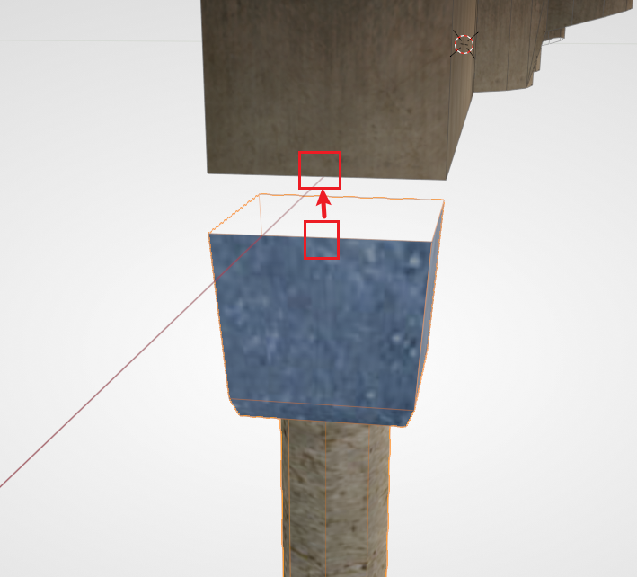
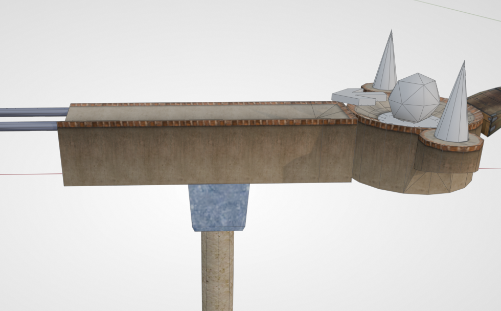
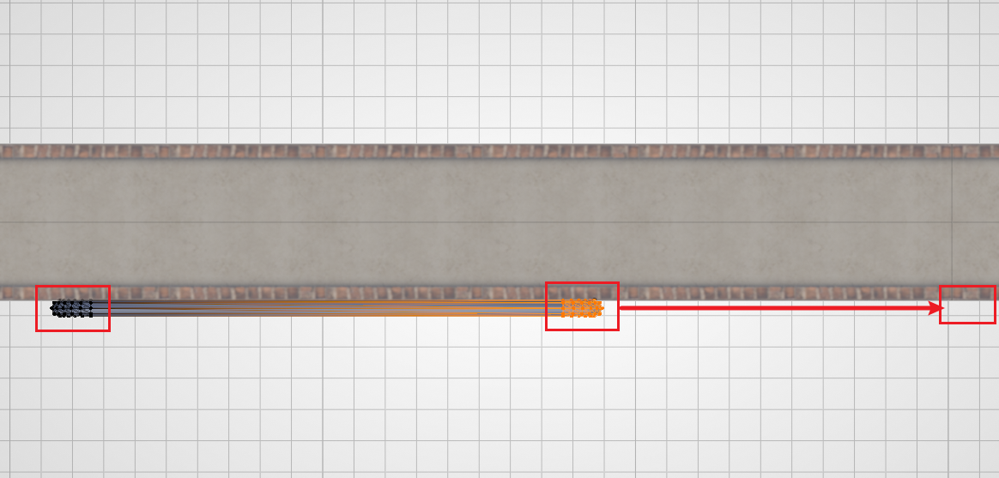
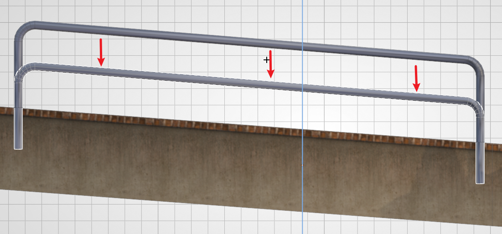
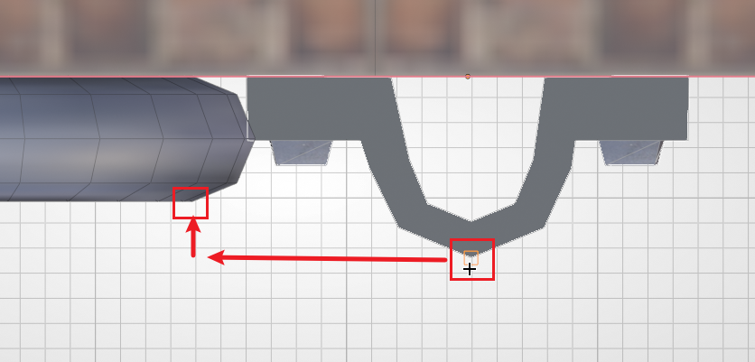
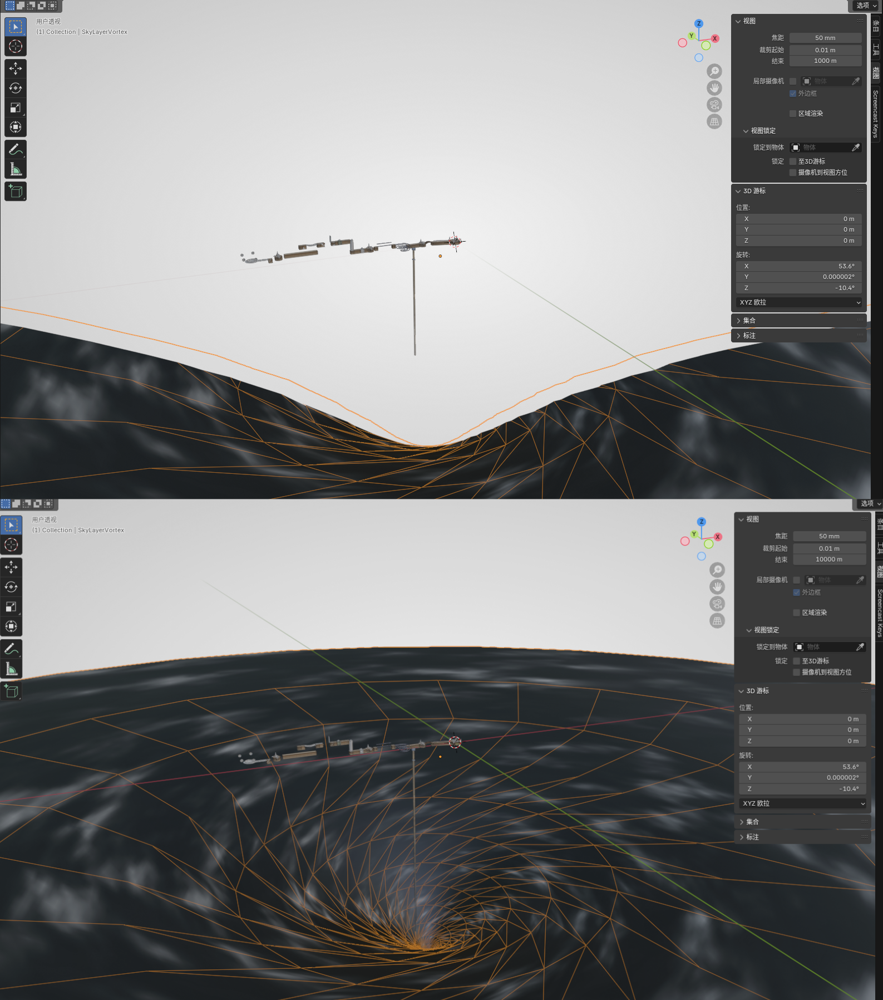
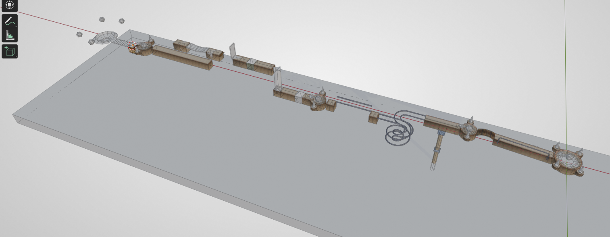

# 装饰与死亡区

之前介绍的元素可以制作一个能游玩的关卡，而一个好的关卡还需要一定的装饰。本章内容介绍 Ballance 内常见的装饰，以及死亡区的应用。

## 柱子

柱子在原版关卡内随处可见。柱子不仅用于路面的承接（承接其实是纯视觉效果，路面显然不会自己往下掉），上方还可以拼接一个用于装饰的路灯（仅装饰，不发光）。并且柱子的长度其实是有限的，底部的圆柱使用了一张渐变的透明纹理，在游戏中看起来就好像一直延伸到地面一样。

!!! note "扩展知识"
    在以往的制图工作流当中，由于 Virtools 的兼容性问题，我们放置的柱子很容易出现 **断层** 现象，这实际上是游戏内的纹理参数故障导致的，使得柱子无法正确地识别渐变纹理。同样故障的还有路灯中黄色的光晕、灯影等。而 Blender 制图是直接生成对应 Virtools 2.1 的 nmo 文件，若不用 Virtools 进行二次保存，一般不会出现上述问题。参见：[柱子不断问题](../trouble-shooting/transparent-column.md)。

资产库中提供了柱子、带路灯的柱子以及单独的路灯。其中路灯柱子的摆放没有严格规范，参照原版，或是摆在你喜欢的位置就可以。

而用于视觉上提供支撑的柱子则推荐吸附至路面下方，如下图所示。下图用到的吸附是 **中点吸附中点**。

随后可以滑移至任意位置。实际位置也并没有具体的规范，只需要看起来比较合理即可。

## 护栏

护栏同样在原版中随处可见，但不同的是，护栏比柱子的放置要麻烦许多（这可能也间接导致了很多粗糙的自制地图不愿意放护栏）。

护栏由两部分组成：**钢轨** 和 **钉扣**。护栏与普通钢轨的区别在于，护栏的直径更小，看起来更细，除此以外其它属性与钢轨都完全相同。

下面用一段直护栏来演示。首先我们从资产库中拖一个护栏钢轨出来。切换到顶视图，将护栏贴至路边，然后进入编辑模式，将两侧的顶点拖到想要的位置。

然后再切换到侧视图，将 **护栏的底部** 与 **路面的顶部** 对齐。图中演示的是斜面，所以对齐时采用了编辑模式，在顶点模式下进行。对齐后再将护栏下移 `2.5` 即可。

然后添加一个钉扣，同样贴至路边。然后 **限制移动** 为 **路面延伸方向**，利用顶点吸附将护栏和钉扣对齐。如下图所示：

最后效仿护栏，从路面顶部下降 `1.25` 即可（一般就是钢轨下降高度的一半）。

!!! note "提示"
    由于原版游戏内的护栏和钉扣 **下降高度是不精准的**（大概率是随手放置的），所以本教程给出的值 **仅供参考**，只是原版中测出来 **相对** 平均（且好记）的值。制图者若不想做到如此精细，或有自己的设计的话，可以自己取舍下降高度。

## 云层

原版游戏中共有两种云层：

- 1 ~ 11 关的普通云层
- 12 关的漩涡云层

这两种云层在资产库中都有提供，一般而言只需摆放出来即可。云层的高度可视情况自行决定。一般而言，在游玩过程中，不应该看到云层的边缘（十分不美观）。

值得注意的是，云层一般都非常大，我们在 Blender 中放置的时候，如果缩小视图，就会发现云层只能显示一部分，或者拉到够远时直接不显示了。这是因为 Blender 的视图设置了默认的最大视距为 `1000`。要更改也很简单，只需在视图内按下 `N`，然后找到“视图”选项卡，再把视图中的 **结束**（End）调成更大的值（例如 `10000`）即可。下面是调节前后的对比：

云层可能会很影响其它物体的编辑，很容易一不小心选中或者是让背景看起来乱糟糟的；并且隐藏的云层在游戏中也可正常显示。所以建议将云层放好后可以直接隐藏。选中云层按下 `H`，或者在大纲视图（Blender 默认视图右上方区域）内点击云层物体对应的眼睛符号，即可隐藏。

## 死亡区

死亡区是一种用于让玩家球死亡并重置的物体，因为玩家掉球后如果不触碰死亡区那就永远没办法上来了。

创建死亡区很简单，只需要用 Blender 内置的方块即可。`Shift + A` 创建好方块后，我们切换到顶视图，然后按 `G` 把它移动到地图大概的正中心位置。然后按 `S` `X` 和 `S` `Y` 把它放大，直到覆盖整个地图的底部。然后我们切换到侧视图，按 `G` `Z` 把它往下移动到合适的位置，让球只有在掉出路面的时候才可能碰到死亡区。最终的效果大致如下：

死亡区在游戏中也无需显示即可生效，所以我们一样要将其隐藏（不然在游戏里就可以看到这些巨大的方块了）。

!!! note "提示"
    如果你的地图跨度太大（不论是水平跨度还是竖直跨度），可能使用多个较小的死亡区会比使用一个巨大的死亡区要更好。

!!! note "死亡区的判定"
    死亡区的判定方式为边界盒（Bounding Box）。所以不要企图使用复杂网格/旋转网格来制作特殊形状的死亡区。如果实在需要特殊形状的话，应该创建多个死亡区以达到相似的效果。参见[自制地图概述的死亡区解释](../mapping/introduction.md#死亡区)

<!-- TODO: ## 自定义模型 -->
