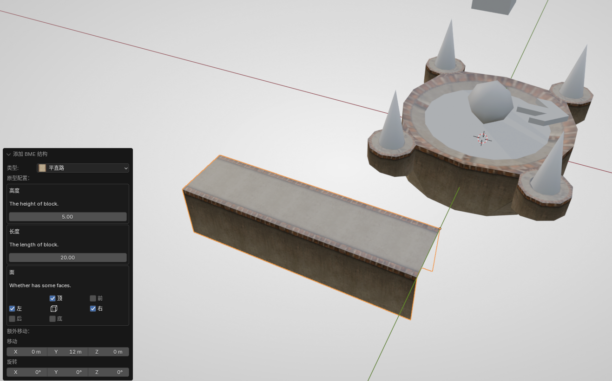
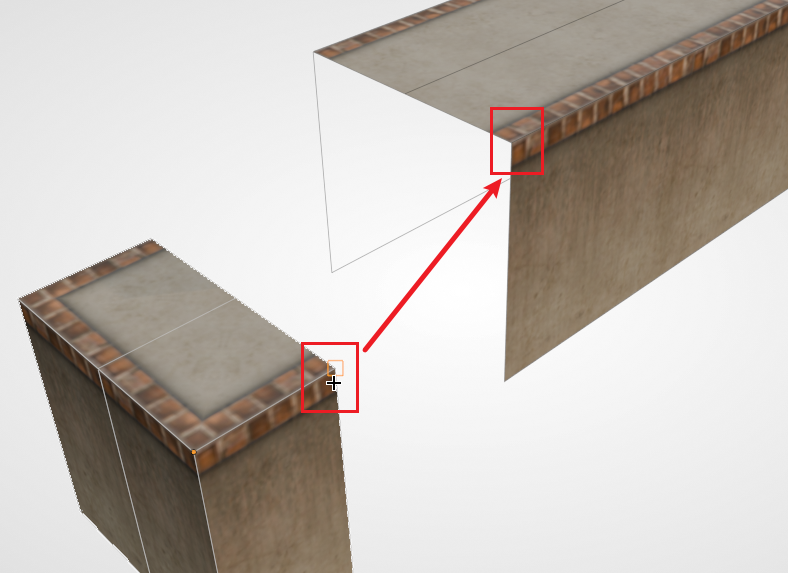
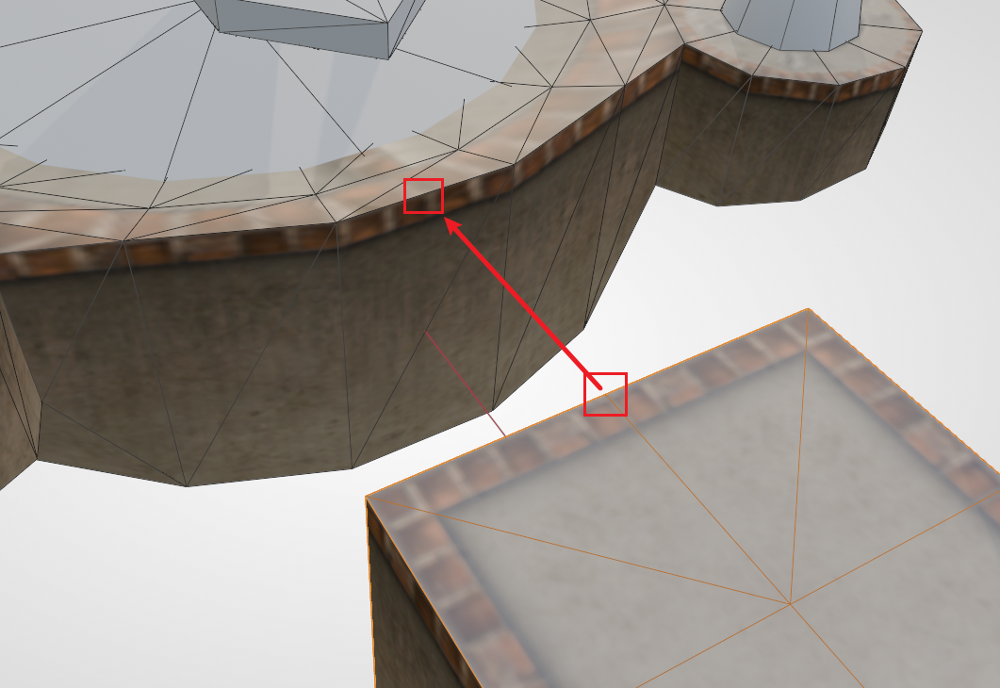
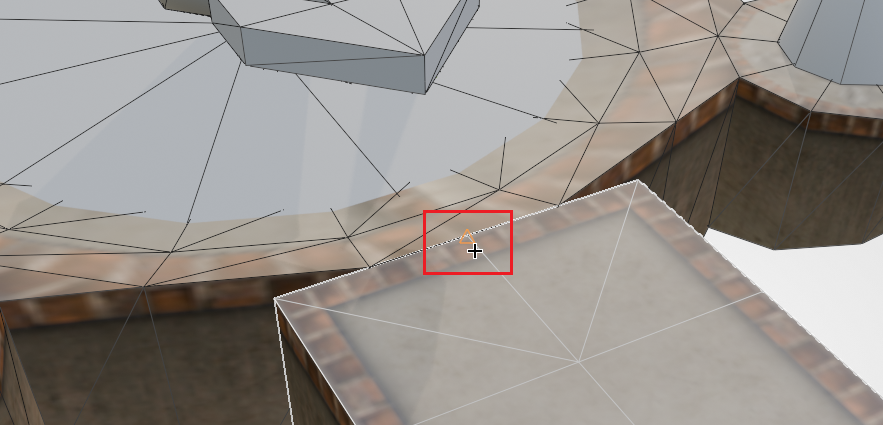
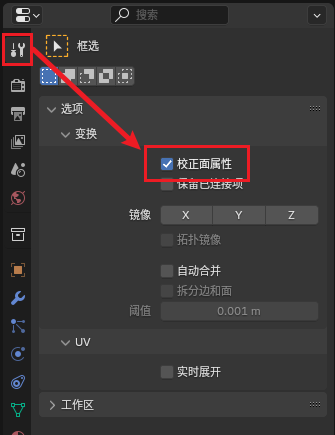
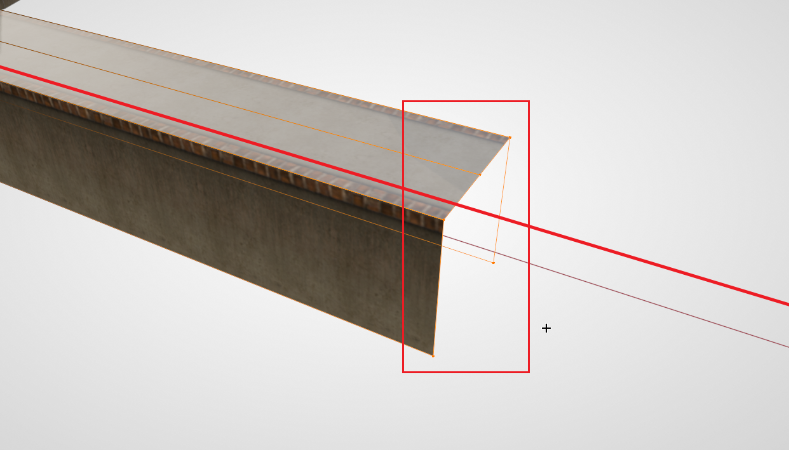
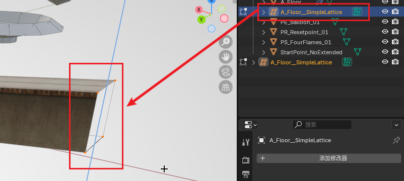
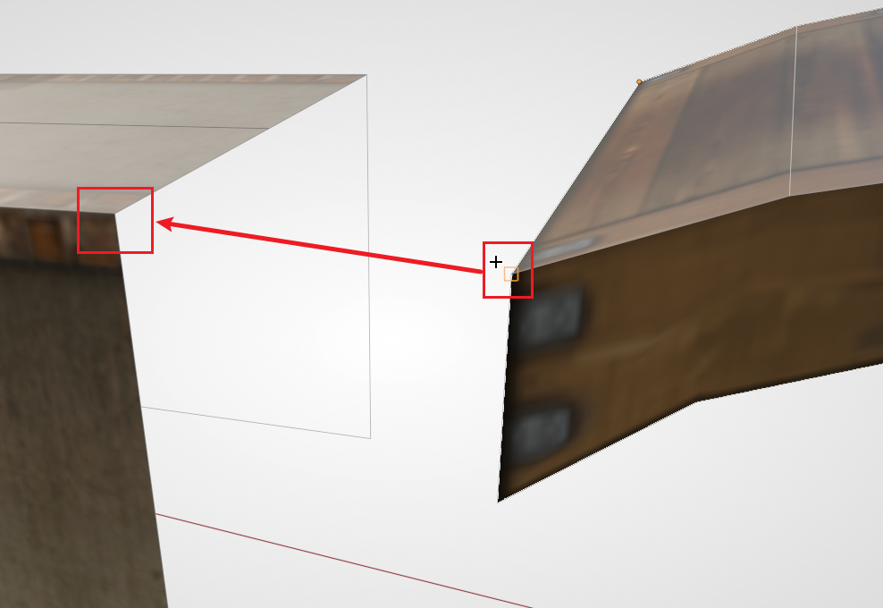
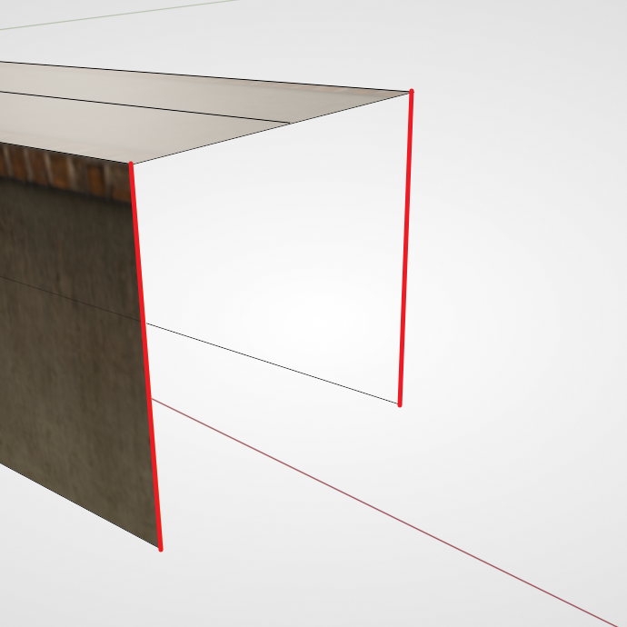
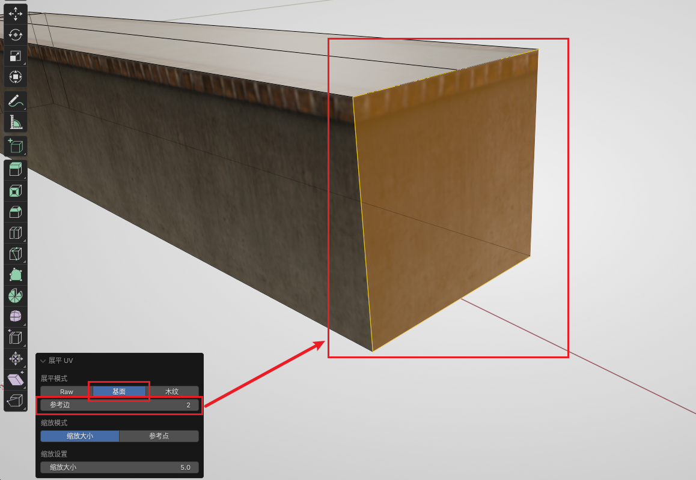

# 第一小节：拼接路面

本节我们将演示如何制作 Ballance 中的原版风格路面。

在制图时，最基本、最常用的路面制作方式是拼接。类似于拼拼图，我们用直线路、拐角、路口，这些基本的方块拼接出复杂的道路。

## 有哪些基本方块

首先我们需要分清 Ballance 原版风格中一般存在哪几种道路：

- 平地路面：最为常见的，宽度为 5 的路面。
- 宽路面：更宽，两侧带有凸起保护的路面。例如 1-1 开头便是。
- 凹路面：中间有下凹的路面。
- 细边花纹路面：一般用于边缘带凸起保护的大平台。

每种路面都会有几种基本结构：

- 直线
- 拐角
- T 字路口
- 交叉路口
- 直线末端

此外还有一种特殊的，用于平地路和凹路之间的：平凹转换路面。

初步了解了各种路面类型后，我们来实操制作一段路面。

## 添加平直路

BBP 已经为我们提供了上述所有路面的基本结构，我们尝试生成一段平直路。**首先将3D游标移动到比较空旷的位置**。

!!! note "提示"
    按住 `Shift` 的同时点击 **鼠标右键** 即可快速更改3D游标的位置。

    默认情况下，你的3D游标位于世界的原点。由于物体默认会添加在3D游标的位置，所以直接生成路面的话，会被上一小节放置在原点的盘点路面遮挡住，这样不方便观察与选取。一定记得善用3D游标！

按下 `Shift + A`，生成一段平直路（Normal Floor）。在进行其它操作（包括“移动”）前，首先观察左下方的对话框。对话框中可以选择高度与长度，默认情况下保持高度为 5 即可；长度可以自由设定，后续也有办法修改。

此外注意到下方有一个“面”参数，该参数控制的是路面的各个面是否生成。例如对于平直路来说，默认只生成顶面和左右两个侧面，其它的面都是空的。这是为了节省地图大小以及游戏内渲染开销，**制图时习惯删除玩家不可能看到的面**。平直路的前后一般会与其它路面相连，所以没必要创建面。当然在某些情况下，前后面也会外露，这时可以在生成时就利用“面”参数将其补上，保证视觉效果上的正常。

这里我们创建一段长度为 20 的路面（不补前后面）备用。

## 路面拼接

路面拼接是构建路面中最主要的操作。首先我们在一个实际应用场景中尝试一下。

目前长直路的两端是空的，我们尝试给其中的一端添加一个末端结构。首先添加一个平直路末端（Normal Floor Terminal），保持其默认生成选项。

然后选择该末端结构，按下 `G` `B`，选择开口处的一个顶点，将其吸附到平直路开口的对应顶点上，如下图所示：

!!! note "提示"
    为了方便演示，上图开启了线框叠加显示，**并不是** 进入了编辑模式。切记 **物体的对齐** 永远需要在 **非编辑模式下** 进行。后续配图如非是 **明确指出** 需要进入编辑模式，一般都是在物体模式下进行操作。

然后你应该能发现，这两个结构已经完美地贴合在一起了。取消选中之后应该是看不出任何物体接缝的。当然路面材质上 **可能** 会存在细微的接缝，对于这种情况，由于游戏内一般很难看清，所以我们不做处理即可。

由于此时两个结构只是相邻贴在一起了，你可能希望他们真正地合并为同一个物体，这也很容易，只需要将他们全部选中，然后按下 `Ctrl + J` 即可合并。但要注意的是，此时我们合并路面只是为了更方便，能够一次性移动多个路面结构，实际上这些路面结构虽然合并为了一个网格，但他们仍然 **各自独立**。这一点可以先保留不用考虑，等到该教程做整体收尾工作时会一并展示如何真正合并网格。

## 更多可吸附点

此时我们的路面是独立与盘点放置的，现在我们需要把路面和盘点对齐。如果你以前使用过 3ds Max 中的对齐，你可能会相当“中心对齐中心”保证两者轴线方向对齐，然后再使用“最大对齐最小”保证路面终端与盘点贴合。实际上我们继续利用强大的吸附功能即可。

先将刚刚的路面经过旋转和移动，使其大致方向、位置与盘点相对应。然后选中路面，按下 `G` `B`，选择路面末端 **上边的中点**，然后吸附至盘点 **外侧上边的中点**。如下图所示：

正确吸附到盘点上边的中点时应该会像下图这样显示（即中点位置出现一个 **三角形标志**）：

如果你成功对齐了上述操作，那么你已经学会了如何制作路面了。可以跟随自己的想法再多做几条路面进行练习。

## 路面伸缩

假如你已经生成了一段 **平直路**，但出于某种原因你觉得长度不够（或太长），希望再次调整路面的长度。而这时已经没有 BBP 的对话框能够给你调整长度了，并且你可能会想到缩放操作，但却发现路面的材质也会被拉伸，视觉效果很糟糕。这时其实并不需要再额外创建一段路面，而是可以直接通过移动顶点的方式拉长网格本身。

首先我们按 `Tab` 进入编辑模式。要注意的是，默认情况下，拉伸网格同样会拉伸路面的材质，我们需要开启 **矫正面属性** 的功能。开启后，Blender 会自动帮我们矫正 UV，这样材质就会自动延展而不是被暴力拉伸了。开启位置在工具面板的 `选项 - 变换 - 矫正面属性`。如下图所示：

!!! note "提示"
    找不到 **矫正面属性** 开关？要先进入 **编辑模式** 才会有这个开关哦。

然后开始操作顶点。**按下 `Alt + Z` 开启透视模式**，选中 **缺口这一端** 的所有顶点，然后按下 `G`，再限制一个轴（下图中的红线是限制的 X 轴），沿轴向拖动顶点即可。

!!! note "提示"
    务必开启透视模式再选择顶点。因为 BME 创建的结构，可能会有多个顶点位于同一个位置。不开启透视模式会导致选择不全，无法完整地拖动端面。

## 制作坡面

在 Ballance 中的赛道并不总是位于同一水平高度，坡面是非常常见的。下面将演示如何制作坡面。

对于一个普通的 **直路**，制作坡面是非常简单的。因为其只由两端的顶点决定中间的线条，所以根据上述描述的伸缩路面的方法，选中其中一端的顶点，然后将移动限制在 Z 轴即可。

但有些时候，中间的直线并不完全由两端的点确定（即中间可能有其它的分段，例如我们前不久结合到一起的带端面的路面），此时我们需要用到更高级的方法来构成坡面，最常用的方式为 FFD（晶格形变）。

!!! note "提示"
    晶格形变是建模中常用的一种形变手段，可以将一个复杂的网格映射到一个简单的立方体网格，编辑晶格的网格会将各顶点的位移传递给目标网格。这里我们对一个路面使用晶格形变，是为了制作坡面时均匀地传递坡度变化，使路面在形变之后仍能保持直线。

由于 Blender 自带的晶格不太方便 Ballance 制图使用 ~~（事实上就是相当便秘）~~，这里我们推荐使用一个叫做 Simple Lattice 的插件（见[工具安装与配置](../mapping/installations.md)）。安装启用插件后，右键路面，选择菜单里的 `Simple Lattice Create`，此时插件会做几件事：

- 根据选中物体的边界框创建一个晶格
- 将选中物体绑定到这个晶格
- 进入晶格的编辑模式

一般情况下我们制作坡面时不需要设置额外的晶格细分，插值类型保持线性即可。更丰富的 FFD 参数可以自行探索。此时选中其中一端的点（此时应该是处于晶格的编辑模式，而不是物体的编辑模式），然后向上移动，即可看到坡面效果了。

一般情况下，我们可以保留这个晶格，以便后续继续调整。如果你对坡度满意了，可以将现在的状态固定下来，操作方法如下：首先记得退出编辑模式，然后选中物体，找到它的修改器面板，应该会看到一个 `SimpleLattice` 的修改器，选中该修改器后按下 `Ctrl + A` 应用修改器。应用完毕后，网格就会固定成当前的状态。此时 Simple Lattice 创建的晶格也可以被安全地删除了。

## 补面

我们注意到路面还有一面是有缺口的，如果拼接其它路块如路口、平凹转换等，或者直接拼接一个道路末端结构，这个面会被挡住，我们就没必要将其补上。但也有很多时候我们需要直接补上这个面，而不是拼接一个新的末端。

假设我们想在这个位置后面衔接一个小拱桥，按照原版的地图风格，这个面应该被补为一个侧面的材质。首先我们从资产库中拖一个小拱桥出来，使用吸附功能将路面和拱桥拼接在一起。

可以发现，连接处由于路面没有被遮挡，缺失的面露出，会非常难看。此时我们使用孤立模式单独编辑路面。选中路面后按下 `/`，可以暂时隐藏其它物体（稍后再按 `/` 就可以回到正常模式），只观察路面。进入编辑模式，我们按 `2` 切换到 **边模式**，然后选中缺口的两条 **侧边**，如下图所示（图中的红线就是要选中的两条边）：

然后按下 `F` 创建一个面。这时你应该能看见一个很糊的侧面被补出来了。此时我们保持对这个面的选择（或者切换到 **面模式** 重新选中这个面），然后打开 **Ballance 菜单** 中的 **展平 UV** 功能。注意到左下角的对话框，我们需要选择路面专用的展平选项（第一排的第二个），然后调整参考边（对于一个四边形的面，只需尝试 0、1、2、3 即可），直到我们侧面的花纹变得合理。这样就补好了一个面。

你也可以用同样的方法，给我们刚刚拖放出来的小拱桥补面。

## 接下来

可以自行创建一些路面，构建迷宫桥梁等结构。熟练路面操作后，可以进入到下一小节：[第二小节：构建钢轨](./sector-2.md)。

此外，除了上述拼接的方式，我们也有更高级的方式创建路面，例如[放样制作路面](../advance/sampling-floor.md)。
