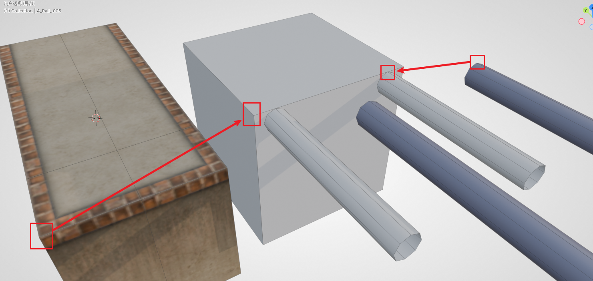
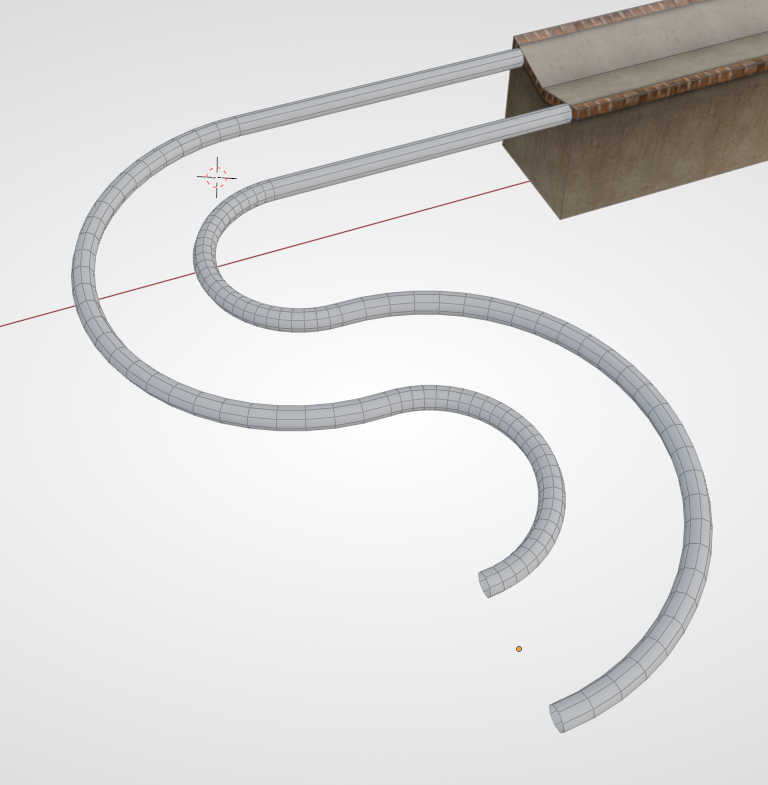
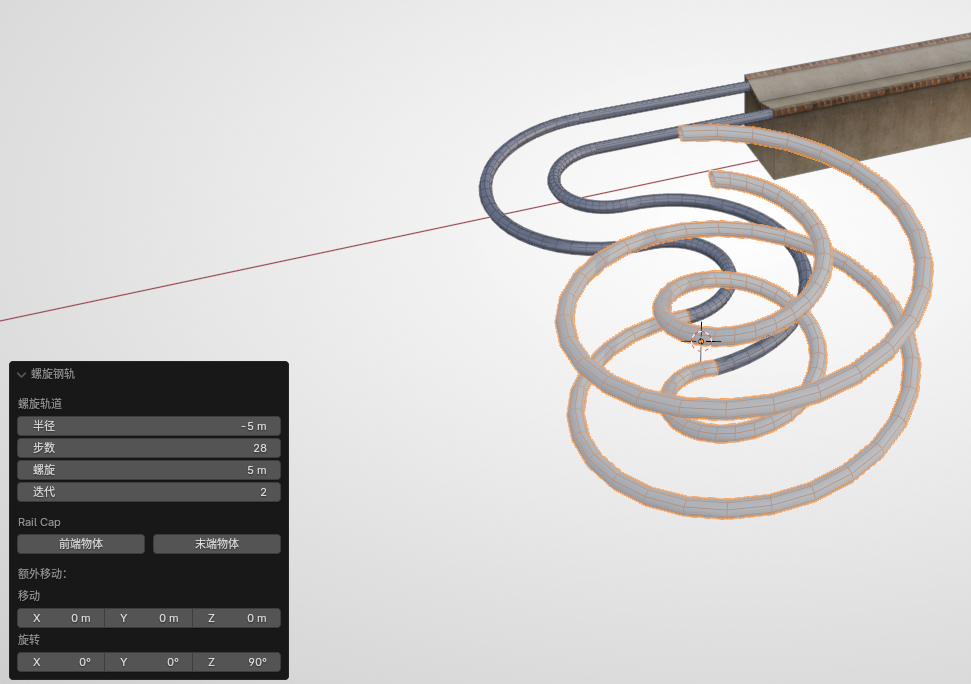
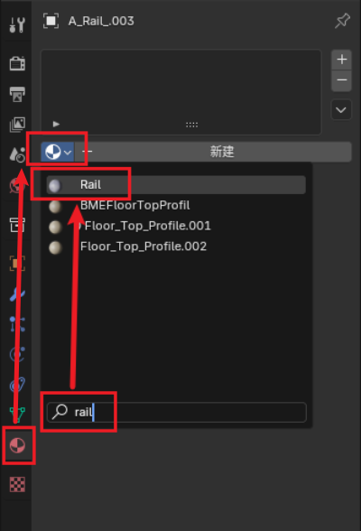

# 第二小节：构建钢轨

本节我们将演示如何制作 Ballance 中的原版风格的钢轨（也叫轨道）。

制作钢轨时较普通路面而言灵活性更高，除了直线、拐弯以外，还存在侧轨、螺旋、螺旋侧轨、自由轨道等诸多变种。本章教程将逐一进行讲解。

## 直轨对齐

BBP 提供了几种基本的钢轨结构，我们首先添加一段直线轨道，其作用普通直线路面差不多。你可以在钢轨上也尝试一下普通路面的各种操作（如拉长、拼接、补面等），这里就不再赘述。

这里介绍一下轨道如何与路面等对齐。由于钢轨并不像路面一样具有 5x5 的网格，也就没法直接用吸附的方法进行对齐。下面给出一种对齐思路。

- 首先沿钢轨方向移动，将钢轨贴到路面上。
- 然后是截面方向的对齐。一般情况下，没有结合其它物体的钢轨和没有结合其它物体的直路，可以使用 max 对齐工具中的“中心对中心”模式进行对齐。
- 最后沿 Z 轴移动，将钢轨的顶面与路面顶面对齐。（如果凹路面就和顶部的边对齐，如下动图所示）

如果 **路面和钢轨较为复杂**，无法使用 max 式对齐的话，也可以用上述方法制作一个辅助对齐物体（如下图所示），然后将 **方块部分与路面重合**（利用顶点对齐），然后再将 **钢轨顶点对齐至辅助钢轨上**，最后移除这个辅助物体即可。~~偷懒的话也可以目力对齐（x~~

还有一种方式是，进入编辑模式，选中要对齐的面，然后 **将3D游标移至选择**，后续可以将物体的原点移至3D游标，这样也能使用 max 对齐工具进行“轴心对轴心”对齐。具体的思路非常多，教程中不可能一一列举，读者应自行判断，灵活运用。

## 侧轨介绍

侧轨的参数比较简单，但有一个特殊的参数，即侧轨类型。

- 普通：仅供木球和纸球通行的一般侧轨。
- 石球专用：倾斜角度更大，让石球也能通行。

其它参数与普通钢轨无异，故不多做介绍。

## 弯轨介绍

弯轨的参数稍多，其中比较重要的解释如下：

- 单轨/双轨：创建轨道的类型。
- 半径：这里的半径指的是钢轨中心轴线与原点之间的距离（如果你选择创建单轨则更明显）。
- 步数：环形的物体也是由多边形面构成的。步数越高代表在该段轨道内的面数越多，轨道就会显得越平滑，但也更容易造成游戏卡顿、物理 Bug 等。
- 角度：指钢轨弧线对应圆心角。90度即1/4圆弧。
- 前端/后端物体：自动补面。如果前后不连接其它物体，可以勾选这两个选项，BBP 会帮你把面补上。

下图是两个半径为5，角度为180度的弯轨拼接而成。（与凹路面相连的直线轨道不属于弯轨的一部分）

## 螺旋轨道介绍

BBP 也提供了最常见的螺旋轨道，只需要简单填写一些参数就能生成。关于螺旋轨道的创建参数解释如下：

- 半径、步数：见上述弯轨的参数解释。特别地，半径为负值时将会创建一个反方向的螺旋。
- 螺旋高度：每层螺旋攀升的高度。
- 迭代：可以简单理解为层数。
- 前端/后端物体：自动补面。

还有一种螺旋轨道，被称之为螺旋侧轨，因为它类似于侧轨，只允许球贴在轨道侧面。其原理是借助球的离心运动来保持球不掉落的（其实大部分是玩家输入的力）。螺旋侧轨的参数与螺旋轨道较为相似，故读者可以自行探索。

!!! note "扩展知识"
    原版中螺旋轨道实例有：9-1开头的石球螺旋以及13-5的石球过山车、木球反上螺旋。对于原版中出现过的一些轨道，资产库中有现成的模型可以套用。

    制图技术刚起步时，只能使用 Virtools 和已有的路块去拼接，或者受技术限制，不知道如何制作螺旋、花式轨道。所以不得已会使用原版的轨道。

    但对于目前我们使用着最新的制图技术，**单纯地套用** 原版轨道会显得较为敷衍且没有意义 ~~（除非老活新整）~~。所以一般而言，尽量自行制作独属于地图的独特轨道。对于任意花式轨道的制作，可以参考[放样制作钢轨](../advance/sampling-rail.md)。

## 钢轨材质

你可能已经注意到了，钢轨创建出来默认是没有材质的，在 Blender 中会呈现为灰色的模型。BBP 有一套上材质的流程，较为复杂，需要理解 Virtools 材质等概念，我们可以使用最简单最快捷的方式，即：从资产库中随便拿一个钢轨（护栏也行）出来，此时你的 Blender 项目内就会具有一个名为 `Rail` 的材质。我们只需要简单搜索然后给钢轨添加这个材质即可。随后这个护栏就可以被删除了。

为了在 Blender 中呈现和原版一样的视觉效果，我们保持对钢轨的选中状态，然后在 Balance 菜单中找到 **钢轨 UV** 这一项，点击后弹出的对话框中，材质填写和刚刚一样的 `Rail` 即可。该工具能自动为钢轨分布 UV，让钢轨看起来和游戏中更像（游戏中的钢轨经过平滑，可能仍旧略有区别）。

## 接下来

了解了基本的钢轨制作，我们就可以开始了解如何放置机关了。开始阅读[第三小节：放置机关](./sector-3.md)。

除了 BBP 提供的几种最常见的基本钢轨，我们也可以利用放样的方法制作花式钢轨。参见[放样制作钢轨](../advance/sampling-rail.md)。
