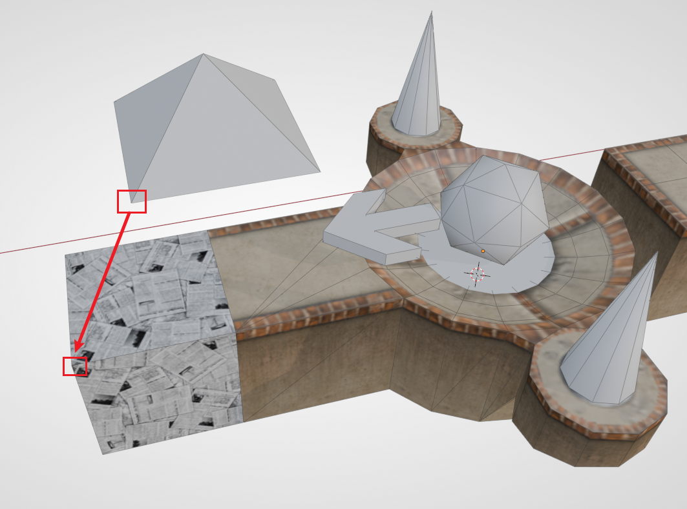
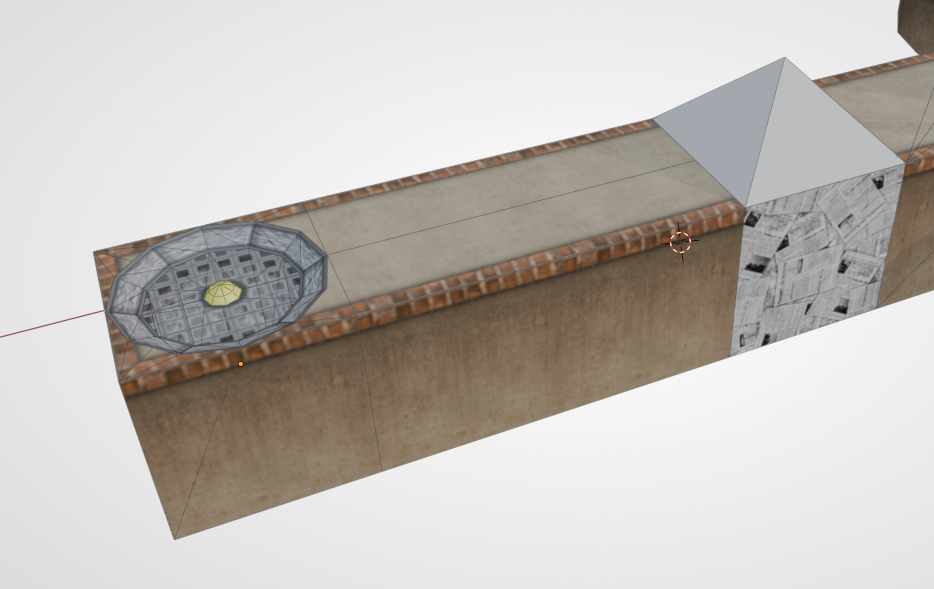
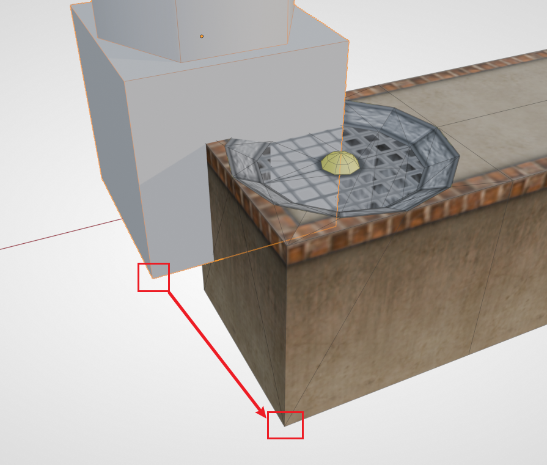
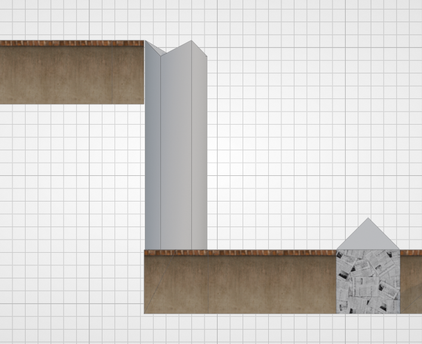
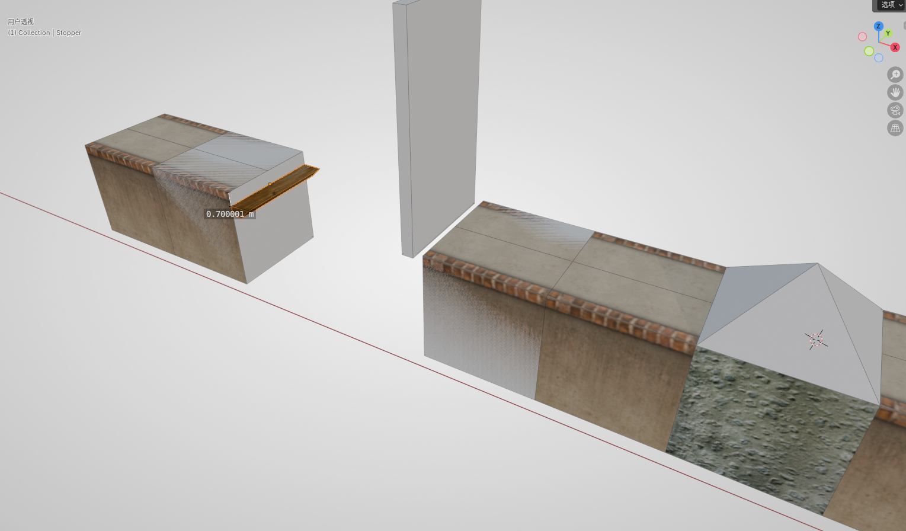
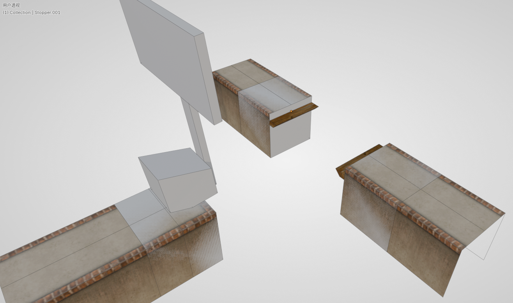
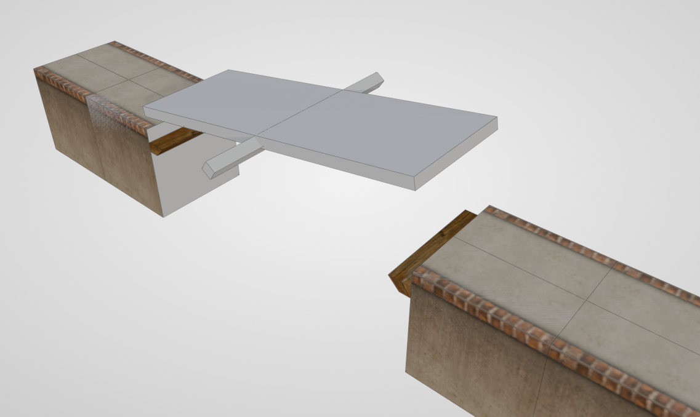
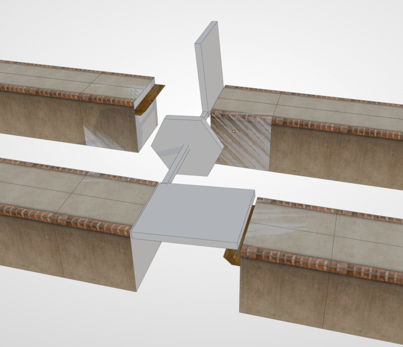
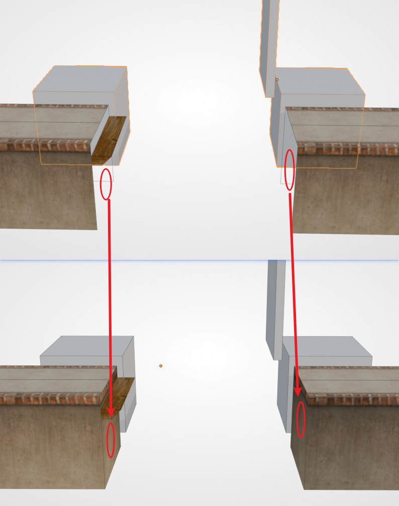

# 第三小节：放置机关

本节我们将演示如何放置机关。Ballance 中的机关（还有道具）在地图文件中都是 **占位符**。就好比我们已经见过的盘点火、重生点、飞船等，它们在游戏中并不是这个样子，而是会被替换为真正的火焰、飞船，而替换的依据实际上是 Virtools 组。我们现在在 Blender 中见到的灰色的模型，只是为了让我们在制图的时候能够更好地通过它的形状来判断是哪种机关。关于机关的具体解释可以查看[机关如何生效](../mapping/introduction.md#机关如何生效)。

## 变球器的对齐

变球器是一种非常常见的机关。玩家球在靠近后会被吸过去，转换为对应球的类型。变球器的占位符表现为一个四棱锥。在放置时我们建议大家使用对应的变球器底座，以在游戏中更好地辨识变球器的类型。

首先我们放置一个带延伸路面的盘点，然后在延伸的路面处拼接一个纸球变球器底座。然后将纸球变球器用顶点吸附的方式对齐到底座上，即，将 **变球器底部顶点** 和 **底座的顶部顶点** 直接对齐即可。

!!! note "提示"
    任何机关添加时，BBP 都会有一个对话框，你需要选择正确的小节数，才能在你想要的小节加载这个机关哦。

    例如本节内容是第三小节，那么纸球变球器的小节数应选择为 3。后续所有的机关同理。选择错了也没有关系，可以查看下文的[调整小节数](#调整小节数)。

## 辅助对齐方块

接下来我们考虑放置一个风扇，将纸球吹起，从而可以达到更高处。首先我们先制作一小段路面，防止风扇和纸球靠得太近。然后在道路末端，从资产库内找到一个 **一端开口** 的风扇底座拼接上去。

!!! note "拓展知识"
    1. 风扇底座和风扇的“风”其实是分离的哦：底座是路面的一部分，归入路面组；风是机关，归入机关组、小节组。
    2. 风扇不可以靠变球器太近。靠太近的话会导致换球后风吹不起球，玩家需要后退一下才能被吹起，设计上不推荐这样做。

然后利用 BBP 添加一个 **风扇机关**（`P_Modul_18`）。我们注意到风扇机关的底部有一个方块，而方块以上则是一个柱状的风柱，示意了游戏内风扇的风柱。底部方块的作用即是方便我们对齐风扇底座。如下图所示：

使用顶点吸附我们能非常方便地将机关放在正确的位置。然后我们可以在最顶端的位置放置一段路面来承接纸球。

事实上，只要是与路面有关联的机关，它们的占位符都带有这样的辅助对齐方块，方便我们快速地添加机关。制图时应当灵活使用顶点吸附的对齐方法。

## Stopper

部分机关需要玩家球推倒，然后形成新的道路。像这样的机关，它们倒下后，需要有一个东西来承接住它们，否则它们不会正常地形成可以通过的路面。这种东西被我们成为 Stopper。

!!! note "拓展知识"
    这个名称源自于游戏中的组名称，此类物体全部都归到了一个名为 `Phys_FloorStopper` 的组当中。

需要 Stopper 的机关列表如下：

- 推板（25）
- T 板
- 翘翘板
- 二翼桥/双向推板

这里我们用推板来举例。首先我们在刚刚制作的位置后续继续添加石球变球器，然后制作一段路面用于助跑，再添加一个需要用木球或石球推动的推板。然后从资产库中拖一个 Stopper 出来，对齐到对面的路面。**再将 Stopper 相对路面高度下降 0.7**（输入 `G` `Z` `-0.7`）。最终效果如下图所示（图中的高度标注有误差，实际制图时按 0.7 来制作即可）：

接下来我们再来看几个其它需要 Stopper 的结构。（该部分只是演示 Stopper 标准摆放的位置，读者可以按自己设计做进地图里）

**T 板**：

**翘翘板**：

**二翼桥/双向推板**：

!!! "提示"
    Stopper 有一个问题，即只有地图里的第一个 Stopper 与机关相碰时会发出声音。这是游戏设计时的一个[漏洞](../trouble-shooting/stopper-sound.md)，为了避免这个漏洞，我们可以把地图中的所有 Stopper 合并为同一个，参见 [Stopper 合并](./clean-and-release.md#合并物体)。

## 补面

放置带有辅助方块的机关时，我们还需要注意路面的补面。例如之前我们放置的推板，要注意辅助方块可能会挡住侧面，导致检查不到缺失的部分。游戏中的机关都是没有所谓的辅助对齐方块的，所以缺面的问题会一览无余，影响美观。所以在制作时，一定要及时将面补上。

## 连续机关

Ballance 中有一部分机关是可以连续使用的，例如：**风扇**、**秋千**、**箱式浮板**。BBP 中也提供了相应的工具，可以快速地创建一系列连续机关，其中固定的参数为：`小节` 和 `数量`，用于确定机关的所属小节，还有生成机关的数量。特殊的参数为偏移值/偏移向量。下面举例说明：

- 连续箱式浮板：默认的间距是 6，也刚好符合原版中出现的间距。
- 连续秋千：默认间距为 15，且默认会使秋千交错放置。交错放置能够使相邻两个秋千摆荡时刚好靠近，允许任何球通过。
- 风扇柱：默认 Z 轴方向偏移 15。该默认值可以快速地制作一个竖直的风扇柱，这在原版中不常见，但在自制图中经常出现。此外也可以设置任意方向的位移，做出风扇阵列。

## 脓机关

脓机关是中文社区的术语，常常出现于自制图中，是指将数个相同的机关元素叠加在同一个位置。常见的脓机关有两种：**脓分**、**脓风扇**。

- **脓分**

将数个分数球叠加在一起，玩家吃到时可以迸发非常多的追踪分数球，一般用于视觉效果呈现，或纯粹作为一个大型分数奖励，激励玩家走设计的路线。我们注意到脓分生成出来后，它们的旋转角度是不同的，这是为了在游戏中，让这些分数看起来更加美观（而不是被叠在一起）。

- **脓风扇**

脓风扇是叠加了多个风扇，数量足够时能够吹起木球和石球，也能让纸球一飞冲天，甚至顶起木箱等道具。吹起木球需要至少 **6** 个风扇，而吹起石球需要至少 **32** 个风扇。可以看到对话框中提供了预设的数量，我们只需选择球的类型即可。当然也可以生成自定义数量的风扇。

## 调整小节数

如果需要调整机关的小节数也很简单，只需改变其归组就可以了。我们可以在物体面板中找到 Virtools 组，然后将小节组（`Sector_0x`）去除，然后添加对应的小节组即可。具体位置请查看：[在 Blender 中归组](../mapping/grouping.md#在-blender-中归组)。

## 接下来

三种基本的游戏内物体：路面、钢轨和机关，到这里就介绍完毕了，你的地图应当已经可以游玩了。但我们还缺少一些重要的装饰，以及让玩家掉落之后重生的检测区域，这些内容的介绍位于下一章节：[装饰与死亡区](./decorations-and-depth-test-cube.md)。
