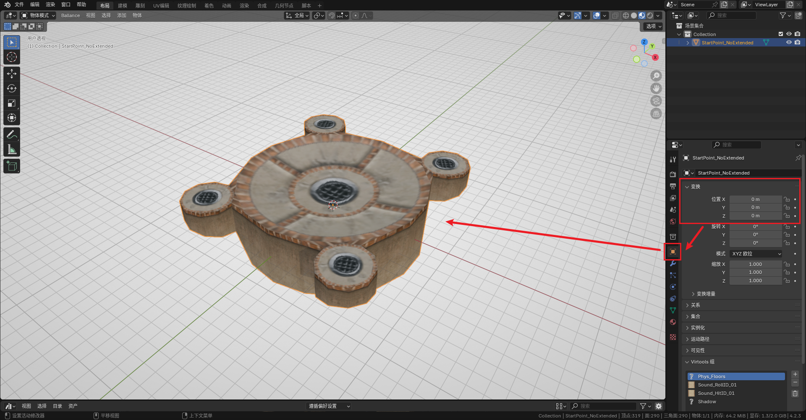
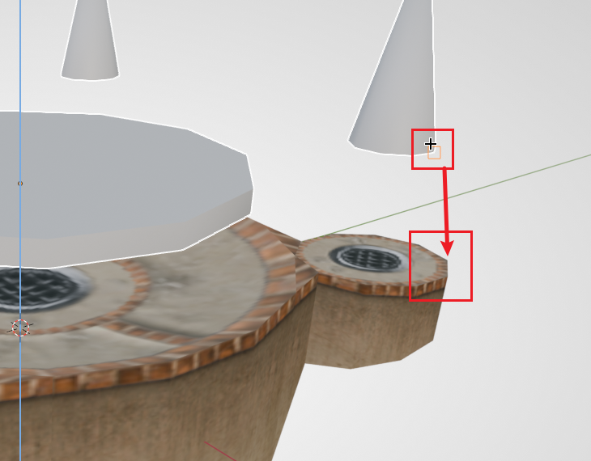
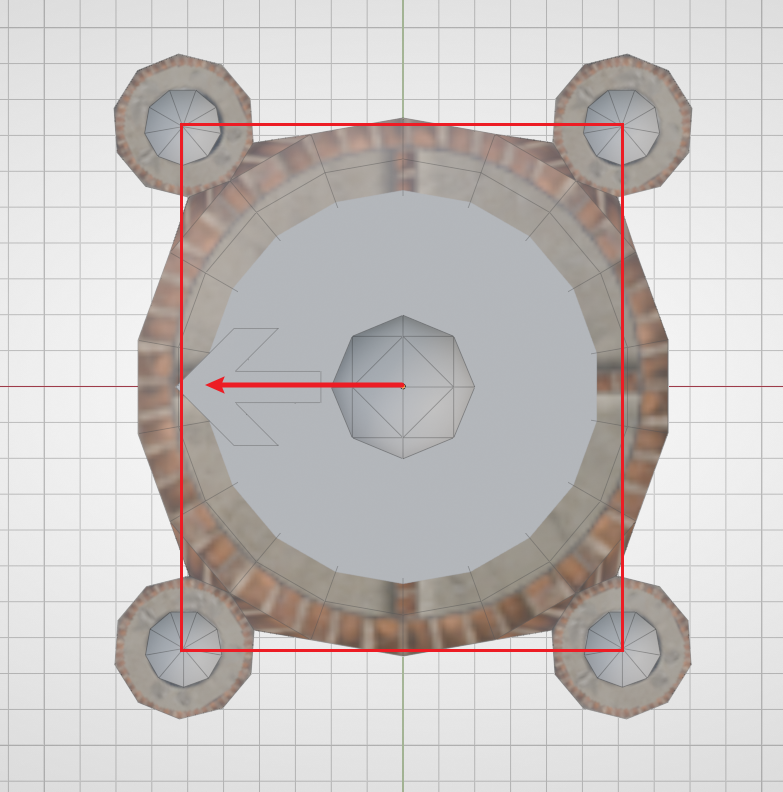

# 最小的关卡

本节教程我们会用最少的工作量，构建一个能导入 Ballance 游玩的自制地图。

## 准备工作

这里假设你的 BBP 插件与 Ballance 制图资产库已经正确安装好了。

首先直接打开 Blender，进入默认模板。在3D视图内，按下 `A`（全选）再按下 `X`（删除），快速删除模板中已有的摄像机、灯光等物体。Ballance 制图时不需要用到这些内容。

随后，将 Blender 底部的时间轴面板拖出来，将其改为资产浏览器，并找到我们的 Ballance 资产。这样可以方便我们在后续流程当中随时取用资产库里的内容。不需要用到资产库时，也可以把面板拖回去，让3D视图有更大的操作空间。

然后将这个 Blender 项目保存到你喜欢的任意位置，防止我们制作的内容丢失。在制作过程中，也请记得勤保存，防止突然断电或 Blender 崩溃等极端情况发生，导致地图丢失。

## 放置盘点路面

盘点，是中文 Ballance 社区的旧术语，也被称作存档点、检查点等。在游戏当中，燃烧着四个或两个火焰的地方就是盘点。由于玩家一般从盘点出发，所以我们先构建一个最基础的盘点。

首先打开素材库，在其中找到一个不带任何延伸路面的 **四火焰盘点路面**，将其拖拽至3D视图即可放置。此时注意到放置出来的盘点是没有材质显示的，我们在3D视图中按下 `Z` 并将鼠标向下移动，松开 `Z` 即可切换到 **材质预览模式**。该模式下可以看到大部分物体的材质显示，方便我们制图。

一般情况下我们建议把盘点放置在地图的正中心，也就是原点位置。在右侧的物体面板中，将它的座标改为 `(0, 0, 0)`。

注意这只是一个盘点的路面，我们还缺少了 **盘点火焰** 和 **重生点**。

## 放置盘点火与重生点

游戏中，除了盘点的路面，盘点还会有 **火焰**（也叫检查点，玩家到达火焰时将触发下一小节），并且需要指定玩家球的 **重生点**（玩家球死亡后会在重生点位置复活）。

因为盘点结构重复性高，BBP 为我们提供了 **小节盘点组合**（即 重生点 + 检查点火焰 的组合）。按下 `Shift + A` 添加一个 **小节组合**（Sector Pair），小节数选择 `1`。小节数为 1 时 BBP 生成的是 **四火焰和重生点**，其它数值时 BBP 生成的是 **两火焰和重生点**，务必注意区别。

由于上一步我们将盘点放在了地图中心，所以这一步生成的小节组合不需要调整 XY 轴位置，只需要调整 Z 轴位置即可。

!!! note "关于3D游标"
    Blender 创建的物体“习惯上”会位于3D游标处。3D游标是 Blender 中一个特殊的指示器，在视图中表现为一个红白条纹相间的圆，并有四条线指向圆心，形如一个准心。按住 `Shift + S` 可以快速调整其位置，或利用3D游标调整物体的位置。

    在添加小节组合之前，我们建议先将3D游标移动至盘点（选中盘点，按住 `Shift + S`，选择正下方的选项），然后再添加，这样可以保证添加的盘点火、重生点可以默认和盘点在竖直方向对齐，我们只需要调整 Z 座标即可。

!!! note "提示"
    下面的操作用到了 Blender 中的[移动操作](../blender/basic-manual.md)与[吸附操作](../blender/snapping.md)。

首先保持同时选中火焰和重生点，输入 `G` `Z`，提高它们的位置，方便观察。然后按 `G` `Z` `B`，选择 **任意一个火焰的底部**，然后将其吸附至盘点的 **顶部**。

如果此时你发现，火焰与盘点的位置对不上，或者是想改变出生点的面朝方向（重生点上的箭头模型代表了玩家出生时面朝的方向），可以只选中你想调整的部分，输入 `R` `Z` `90` 让其旋转90度。习惯上我们希望让玩家球从更宽的一边出发。下图是一个正确的示例（顶视图）：

此外，出于对原版风格的模仿，我们应尽量保持重生点、火焰还有盘点路面，在竖直方向上的相对位置，能够让我们的自制地图玩起来更像原版。

!!! warning "注意"
    编辑重生点的网格是无效的，同理，也不要将重生点物体的旋转应用至网格！

## 添加终点飞船

此时我们的地图还只有一个小节，添加终点飞船虽然不能让关卡变得可以通关，但意义在于让你的地图能被 Ballance 加载，这样就算不能通关，你也可以在完成后续任何工作后，就打开游戏导入地图看一看自己的成果。

添加终点很简单，在 `Shift + A` 中添加一个 **终点气球飞船**（PE_Balloon）即可。

由于只有一小节的地图无法正常加载飞船，所以目前来说，终点飞船的位置不重要，你可以先不管它，只要添加了即可。

!!! note "提示"
    你也可以现在就制作第二小节的小节盘点，这样在游戏内你可以借助作弊模式飞到第二小节然后通关。后续的教程将不再涉及制作盘点的详细步骤，如果不记得如何制作了，记得回来看一看本节内容哦。

## 在游戏中查看

接下来是导出为 nmo 文件。Ballance 的地图文件格式为 nmo，这是一种专用于 Virtools 的文件格式，在以往的制图方法中，我们不得不使用 Virtools 这一极其古老的工具进行保存，才能得到可以正常游玩的地图。但多亏了 yyc 的 libcmo21 以及 BBP 能让我们直接从 Blender 导出 nmo 文件。

在 Blender 左上角的“文件”选项中找到“导出”，选择 Virtools 文件。右侧的导出选项解释如下：

- 导出目标：一般我们选择集合即可。在本教程中不会用到多个集合，所以选择 Blender 默认的 Collection 集合即可。
- 编码：无特殊需求时保持默认（`cp1252;gb2312`）即可。
- 全局纹理保存选项：如果没有用到任何自定义纹理，一律选择 **外部**。
- 使用压缩：建议打开，保持默认即可。若地图文件过大可考虑提高压缩等级，一般而言影响不大。
- 连续小节数：建议打开。BBP 会自动分析你的地图的小节数，从而在正确的时机生成终点飞船。

导出的 nmo 文件无需任何处理，直接像你平时玩自制地图一样，在 Ballance 中进行游玩即可。建议安装 BML/BMLP 并开启作弊模式。其中的许多功能能帮助你更方便地测试你自己的地图。

在你完成任何阶段性操作后，都可以导出地图并在游戏中查看效果，这样能够做到即时反馈，也可以及时地测试你地图是否能正常游玩、是否有模型问题/材质问题等。

## 接下来

阅读下一章节：[第一小节：拼接路面](./sector-1.md)。
